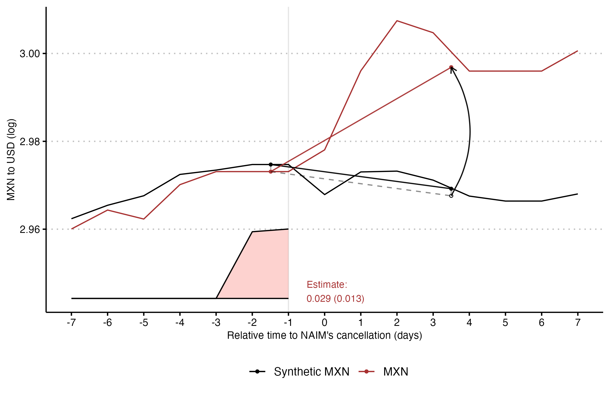

```{r setup, include=FALSE, message = FALSE}
# ------------------------------------------------------------------------------
# RMarkdown Global Setup
# ------------------------------------------------------------------------------

# Set global chunk options for knitr
knitr::opts_chunk$set(
  echo = FALSE,         # Suppresses the code output in the final document
  include = TRUE,       # Includes the chunk output in the final document
  message = FALSE,      # Suppresses messages from code chunks
  warning = FALSE,      # Suppresses warnings from code chunks
  fig.align = "center", # Centers all figures by default
  # fig.height = 4,       # Sets default figure height to 4
  fig.pos = "!htbp"     # Figure placement in LaTeX to be strict and float properly
)

# Additional figure settings (commented out but available if needed)
# knitr::opts_chunk$set(out.width="90%")    # Uncomment to set figure width to 90% of the page
# knitr::opts_chunk$set(fig.pos = "!h")     # Uncomment to enforce float placement closer to the code chunk

# Set global options
options(
  knitr.kable.NA = "",                      # Replaces NA with empty values in tables
  knirt.table.envir = "table",              # Set table environment for LaTeX
  "modelsummary_format_numeric_latex" = "plain" # Forces numeric LaTeX output to be plain format
)

# ------------------------------------------------------------------------------
# Source Master Script for Workspace Setup, Settings, and Data
# ------------------------------------------------------------------------------
source("scripts/POS_master.R")
# ------------------------------------------------------------------------------
```

\newpage
\pagenumbering{arabic}

# Introduction

```{r scm-estimates-intro}
# Monthly estimates ----
# Estimates
monthly_estimates <- read_csv("results/Fig4/scpi_estimates.csv")

monthly_estimates_tail <- 
  monthly_estimates |> filter(name == "diff") |> tail(1)

monthly_estimates_tail <- abs(round((exp(monthly_estimates_tail$value) - 1)*100, 1))

# Quarterly estimates ----
# Estimates
quarterly_estimates <- read_csv("results/Fig5/scpi_estimates_controls.csv")

quarterly_estimates_tail <- 
  quarterly_estimates |> 
  filter(name == "diff") |> 
  tail(1)

quarterly_estimates_tail <- abs(round((exp(quarterly_estimates_tail$value) - 1) * 100, 1))
# Quarterly Investment estimates ----
# Estimates
investment_estimates <- read_csv("results/Fig7/investment_scpi_estimates.csv")

investment_estimates_tail <- 
  investment_estimates |> 
  filter(name == "diff") |> 
  tail(1)

investment_estimates_tail <- abs(round((exp(investment_estimates_tail$value) - 1) * 100, 1))

```


Democracy enhances economic development [@Acemoglu2019]. However, democracies can also incubate an *“internal parasite”*: populism [@Urbinati2013]. Populist leaders often prioritize politics over policy, disregarding both political and economic checks [@Rodrik2018], which typically impedes economic activity. @Funke2023 show the enduring negative impact on GDP per capita, or *populist penalties*, attributed to loose macroeconomic policies [@Dornbusch1991], protectionism and economic nationalism [@Born2019], and institutional decay [@Acemoglu2005; @Acemoglu2019]. Nevertheless, exceptions exist, with episodes where populist leaders coexist with effective policies such as macro-prudential measures, free trade, and democratic institutions that balance their political power.

Noting that policy—a decision, a process, an outcome—does not equate to the polity or political regime, populist leaders often implement policies that reflect their political rhetoric without fundamentally altering the existing regime, particularly in the short term. This distinction is crucial, as the rise of a populist government alone is not sufficient to trigger immediate negative economic effects or a regime shift. This raises a key question: Can populist leaders disrupt economic activity before dismantling the mechanisms that check their political power? And if so, what drives the adverse economic outcomes often associated with populist governance?

One defining feature of populism is the abuse of direct democracy, particularly through referendums and plebiscites. @Rosanvallon2021 argues that *"acclaim for referendums occupies a central place in the rhetoric of contemporary populisms."*^[@Rosanvallon2021 critiques referendums for undermining political accountability, degrading democratic deliberation, and rendering majority decisions irreversible.] Based on various frameworks for understanding populism [@Rovira-Kaltwasser2017], populist policies are often characterized by a lack of technical rigor, disregard for the rule of law, and a focus on delivering swift, visible benefits, often at the expense of long-term consequences. In essence, these policies prioritize politics over sound policy —or *"politics without policy"* [@Schmidt2006]. This paper investigates one such case, using a *macroeconomic natural experiment* to illustrate how populist leaders can impose short-term economic penalties without dismantling institutional constraints, focusing on the misuse of direct democracy to halt a major infrastructure project in Mexico.

On October 29, 2018, shortly after his election and while still president-elect, Andrés Manuel López Obrador (AMLO) orchestrated an unofficial referendum to halt the construction of the New Airport of Mexico City (*Nuevo Aeropuerto Internacional de México*, NAIM), one of the most significant infrastructure projects in Mexican history. Despite polls showing a majority support for continuing NAIM’s construction, the referendum—with less than a 1% turnout—resulted in the project's cancellation. As president-elect, AMLO lacked the legal authority to call this referendum. The misuse of direct democracy in NAIM’s cancellation was widely criticized, occurring before his assumption of office and the implementation of other economic or political policies, as outlined by @Funke2023. This act became known as AMLO’s administration’s *“original sin”*.^[This differs from the macroeconomic concept of “original sin,” which refers to a country’s inability to borrow abroad in its own currency [@Eichengreen2023].]

I estimate the dynamic effect of NAIM’s cancellation on economic activity in the short run. For identification, I argue that NAIM’s cancellation represents a significant shock or natural experiment: a policy change substantial enough to outweigh potential confounding factors within a specific time frame [@Nakamura2018], or an episode that provides observable, quasi-random variation in treatment subject to a plausible identifying assumption [@Fuchs2016].

Political uncertainty increases exchange rate volatility because it creates ambiguity about future economic policies, leading investors and market participants to frequently adjust their expectations, which in turn drives fluctuations in currency values [@Alesina1997; @Bloom2014; @Krol2014; @Beckmann2017]. Using daily exchange rates and a Synthetic Difference-in-Differences (SDID) method [@Arkhangelsky2021], I show that just one week after NAIM’s referendum and subsequent cancellation, the Mexican peso depreciates by 3%. However, when replicating the same exercise for dates between January 2018 and February 2020, no other significant negative shock was found to have increased the exchange rate, including the start of the presidential election campaign in April 2018 and the election day itself on July 1, 2018. Thus, NAIM’s referendum and cancellation provides a plausible macroeconomic natural experiment to study the short-term effects of populist policies.


```{r monetary-cost-estimates-intro, echo = F, include=F}
source("scripts/POS_monetary_costs.R")
```

Leveraging monthly economic activity indicators and quarterly Gross Domestic Product (GDP) data from multiple countries in the Americas, I apply the Synthetic Control Method (SCM) [@Abadie2003; @Abadie2010; @Abadie2021] to create a weighted average that models Mexico’s economic trajectory had the policy not occurred. The airport cancellation has significant adverse short-term effects on economic performance. Before the policy shift, the SCM effectively mirrors the observed Mexican economic activity trend. However, one year after policy implementation, the gap between the SCM and actual economic activity records a `r monthly_estimates_tail`% to `r quarterly_estimates_tail`% decline. A monetary estimate implies that the economic cost of the populist policy is around `r number_to_string(costo_naim_gdp24_usd)` USD (2024 prices), which represents approximately `r round(-costo_naim_gdp24/costo_naim_asf24, 1)` times higher than Mexico’s Federal Audit Office (ASF) official estimated financial costs [@ASF2021].

The results are robust to a battery of falsification and robustness checks involving various estimation methods, the inclusion of time-varying controls, donor pool samples, anticipation considerations, and sensitivity analyses. Moreover, consistent with the argument that NAIM’s referendum and subsequent cancellation serve as a national shock, I construct an SCM for five Mexican regions using quarterly economic activity indexes and show that the decline in economic activity is generalized throughout the country. These results are consistent with the argument that the populist policy is a large and country-wide negative shock.

Why does a policy like halting an infrastructure project result in such pronounced negative repercussions on national economic activity? Consistent with @Fajgelbaum2017 model of uncertainty traps, I argue that the populist policy generated economic uncertainty and decreased investment. In the model, increased uncertainty about economic fundamentals discourages investment because firms prefer to wait for more information before committing resources. During periods of low activity, information flows more slowly, perpetuating high uncertainty and further deterring investment. This cycle traps the economy in a state of prolonged low activity and high uncertainty, making recovery from large shocks difficult and drawn out.

First, I present descriptive evidence of an increase in economic uncertainty following the policy, illustrated by various metrics. Additionally, the SDID results for the exchange rate corroborate the theoretical mechanism where political uncertainty, stemming from ambiguous policy signals, heightens exchange rate volatility. Consistently with this notion of increased uncertainty, credit rating agencies downgraded Mexico’s sovereign debt status following the cancellation of NAIM. Subsequently, I demonstrate a marked decline in investment, with gross fixed capital formation dropping by `r investment_estimates_tail`% compared to a synthetic counterfactual one year post-policy. Other economic components, however, exhibited negligible impacts. While firm-level behavior is not observable in the short term, I present evidence suggesting that the construction sector—critically dependent on investment—saw declines across nearly all regions following NAIM’s cancellation. Lastly, I provide suggestive evidence of the policy’s medium- to long-term adverse effects. Collectively, these findings align with the uncertainty trap model, highlighting the broad economic repercussions of increased uncertainty.

This paper contributes to multiple strands of literature. First, it aligns closely with the literature on populism [@Rodrik2018; @Eichengreen2018; @Rodrik2021; @Guriev2022; @Balduzzi2023; @ORourke2023; @Herrera2023; @Panunzi2024], particularly regarding its economic implications. While a first wave of papers focused on the economic consequences of left-wing populism in Latin America [@Dornbusch1991; @Edwards2019; @Grier2020], populism’s economic effects transcend political cleavages and are a global phenomenon. @Funke2023’s historical investigation into populist regimes identifies a “populist penalty” with a 10% reduction in GDP per capita relative to counterfactual scenarios over 15 years. This study advances the literature by showing that populists can induce economic uncertainty and detrimental outcomes even before engaging in non-prudent macroeconomic strategies, imposing tariffs, or weakening institutional checks. Furthermore, it underscores the short-term sensitivity of economic activity to populist policies, with NAIM’s cancellation leading to a `r monthly_estimates_tail`% to `r quarterly_estimates_tail`% output loss within a year. For comparison, @Born2019 identified a 1.7% to 2.5% output loss 2.5 years after the Brexit referendum, but this paper captures these effects within a shorter timeframe.

Second, this paper engages with the literature on economic uncertainty [@Bernanke1983; @Dixit1994; @Bloom2009; @Bloom2014]. Recent studies provide causal evidence on how economic uncertainty can discourage private investment and consumption, subsequently influencing economic activity [ @Baker2023; @Gorodnichenko2023; @Gorodnichenko2024]. NAIM’s project aligns with the description of investment projects outlined by @Bernanke1983, characterized by their economic irreversibility. Consistent with the uncertainty trap model [@Fajgelbaum2017], its cancellation could signal unforeseen economic uncertainty. This prompts private entities to withhold investment decisions until clearer information becomes available, contributing to a decline in economic activity. This paper contributes to the literature with evidence showing that populist policies can create uncertainty traps, which explain their negative impacts on economic activity prior to dismantling economic and political constraints.

Third, this paper contributes to the literature on democracy and economic performance [@Przeworski1993; @Barro1996; @Rodrik2005; @Papaioannou2008; @Acemoglu2019], particularly within the realm of direct democracy. Direct democracy tends to represent voter preferences more accurately [@Noam1980; @Matsusaka2004; @Matsusaka2005]. However, its economic impacts remain ambiguous [@Feld2001; @Funk2011; @Funk2013; @Born2019]. This study contributes by revealing that when populists use direct democratic tools that fail to correspond with voter preferences, they engender economic uncertainty, deter private investment, and exert substantial short-term adverse effects on economic activity.

Lastly, this study contributes to the literature on the economic repercussions of infrastructure projects. Infrastructure is crucial for economic growth by enhancing market access and fostering development [@Straub2023]. While most studies focus on land transport [@GonzalezNavarro2023], airports and air traffic are less examined. @Campante2018 and @Gibbons2020 show airports’ positive impacts on interconnectedness and productivity. Larger airports are linked to urban growth, especially in services employment [@Sheard2014; @Sheard2019]. This paper highlights the economic losses and spatial spillovers from halting major infrastructure projects like airports.

The rest of the paper is structured as follows. In Section \@ref(context), I provide an overview of the populist policy: NAIM's referendum and cancellation process. Section \@ref(data) presents the data. Section \@ref(empirical-framework) details the empirical framework and identification strategy. Section \@ref(results) shows the results on short-term economic consequences. Section \@ref(mechanisms) presents evidence on the mechanisms. Finally, Section \@ref(conclusion) concludes.

# Context {#context}

Populist leaders often rely on highly visible, symbolically charged actions that resonate with the public but can have far-reaching economic implications. In this regard, the use of direct democracy, particularly referendums, has emerged as a populist tool to challenge institutional authority [@Rosanvallon2021]. In Mexico, President AMLO exemplified this approach when he orchestrated NAIM's referendum to cancel the construction.
This section provides a summary of the cancellation of NAIM.^[I rely on the journalistic work summarized in the podcast *El Aeropuerto* [@Risco2020] and the compilation of memories by @JimenezEspriu2022, former Minister of Infrastructure during AMLO’s administration who oversaw NAIM’s referendum and cancellation.] First, I summarize the project’s origins and history. Second, I describe the 2018 election when AMLO was elected president. Lastly, I explain the timing and reasons provided by AMLO’s upcoming government to halt NAIM’s construction.

**NAIM project.** The Mexico City international airport, Benito Juárez International Airport (AICM), has been operating nearly at full capacity for decades [@AICM2018; @ITF2018]. In response, President Fox proposed an enlarged airport in Texcoco in 2001, leading to land expropriations and tensions with local residents. In 2006, residents near Texcoco were brutally attacked by state forces, with numerous women being sexually assaulted [@Berehulak2016]. The project’s initial cancellation reflected public discontent. Newly elected President Peña Nieto announced the NAIM construction in 2013, relocating it 12 kilometers away and enlisting architect Norman Foster. The project, managed by Grupo Aeroportuario de la Ciudad de México (GACM), was funded through public debt, with private resources leveraged through a tariff on AICM’s use (Tarifa de Uso Aeroportuario, or TUA). Controversy surrounded NAIM’s construction due to dubious feasibility studies, environmental concerns, limited tender processes, and allegations of corruption [@Villegas2017; @Campos2018; @Lastiri2019].

**2018’s presidential election.** AMLO, a blend of left-wing politics and conservative values, fulfills various populist definitions, specially under the *ideational* [@Mudde2004; @Mudde2017; @Mudde2017b] and *political-strategic* [@Weyland2001; @Weyland2017] approaches.^[Besides the previously cited works on populism, see @Rovira-Kaltwasser2017 for a review on the different approaches to define it and its relation to multiple concepts in political science, law, and society.]
According to some scholars, he could be described as a popular nationalist, fighting against the tides of technocratic rule and globalization [@Beck2020]. He emerged as the presidential candidate for the 2018 election after being a pivotal opposition figure since the late 1980s [@BravoRegidor2018]. 
Consistent with the populist ideational approach, AMLO positioned himself as a defender of the ‘people’ against the corrupt elites who, in his view, prioritized economic policies that benefited the rich at the expense of the majority

The 2018 election saw AMLO forming a wide-ranging electoral coalition, tapping into public dissatisfaction with security concerns, corruption controversies, and disillusionment with former ruling parties. During his 2018 electoral campaign, AMLO proposed various initiatives aimed at addressing Mexico’s issues of corruption, poverty, and government inefficiency. His proposals often lacked specific policy details and relied heavily on his personal appeal [@BravoRegidor2018].
He won with a landslide victory, securing more than 30 percentage points of the vote, a result that was widely anticipated by electoral polls by early 2018.

During his first months in office as president, AMLO coexisted with effective policies such as macro-prudential measures, free trade, and democratic institutions that provided checks on political power. He appointed experienced economists in the Ministry of Finance to ensure a stable macroeconomic policy and respected the independence of the central bank, Banco de México. As president-elect, AMLO's team took part in the renegotiation of the US-Mexico-Canada Agreement (USMCA), which he ratified once in office. 

**NAIM’s referendum and cancellation.** Throughout the 2018 presidential campaign, AMLO used NAIM as a political focal point, criticizing it as a project associated with corruption among politicians and business elites. From October 25th to 28th, 2018, as president-elect, he orchestrated a referendum regarding NAIM’s fate. Despite polls indicating over 42% support for Texcoco [@Mitofsky2018], the president-elect chose to bypass the state electoral agency, Instituto Nacional Electoral (INE), opting instead for a non-profit organization to run the referendum. With a turnout of less than 1%, 70% of participants favored NAIM’s cancellation. As president-elect, AMLO did not have the legal authority to call it. Upon taking office in December 2018, the government formalized NAIM’s cessation, respecting property rights by repurchasing bonds to settle debts with investors.

By the time of the referendum and cancellation, at least 20% of the construction had been completed, and 60% of the investment was under contract. Estimations of the project’s potential impact showcase significant diversity. The National Chamber of Air Carriers (CANAERO) estimated substantial positive effects, potentially reaching up to MXN 20 billion in GDP contribution and generating around 200,000 additional jobs within the aviation sector by 2030 [@CANAERO2018]. The International Air Transport Association (IATA) cautioned that cancellation could entail a long-term loss of MXN 20 billion in Mexico’s GDP and the displacement of 200,000 jobs [@IATA2018].


AMLO’s decision to halt the NAIM project fulfills the characteristics of a *populist policy* because it centers on the use of direct democracy, where politics is prioritized over sound policy [@Schmidt2006]. The referendum gave the illusion of democratic legitimacy while sidelining critical institutions, such as the state electoral body, creating a platform for AMLO to align his political rhetoric with action against corruption and elitism.

However, this policy did not immediately shift Mexico’s political regime. In the early months of his presidency, AMLO coexisted with democratic institutions like the Supreme Court and the INE. Only later did his administration propose more radical institutional changes, such as the recent judicial reform aimed at overhauling the Supreme Court [@Kitroeff2023; @Kitroeff2024].^[Consistent with the portrait of a populist government, Figure \@ref(fig:vdem) illustrates the evolution of various subjective democracy indexes for Mexico as presented by V-Dem [@VDem2022]. After AMLO assumed office, many of these indexes began to decline. Nevertheless, it is essential to interpret these measures with caution, as argued by @Little2024.] Critics argue weakens the independence of the justice system and furthers authoritarian tendencies under the guise of democratization [@Gargarella2024].

# Data {#data}

I leverage multiple macroeconomic indicators to assess the potential impact of NAIM's referendum and cancellation affects economic activity and development.
Given the inherent trade-off between precision and frequency, the analysis requires high-frequency data to pinpoint the period around AMLO's announcement of the infrastructure project's suspension. 

First, to show that NAIM's cancellation is a macroeconomic natural experiment, I rely on daily exchange rates using data from the Bank for International Settlements (BIS) [@BIS2024].
I focus on the daily exchange rate dynamics between the Mexican peso (MXN) and the US dollar (USD), while using other currencies from emerging economies for comparison.^[This includes currencies like the Argentinian Peso (ARS), Brazilian Real (BRL), Chilean Peso (CLP), Colombian Peso (COP), Russian Ruble (RUB), and Turkish Lira (TRY).]

Second, to estimate the effects of the policy on economic activity, I make use of monthly economic activity indicators, or leading indicators, which offer timely insights into the various phases of the business cycle. Specifically, I gather these monthly economic activity indicators covering the period from January 2013 to February 2020 for ten countries in the Americas: Mexico, the US, Canada, Argentina, Brazil, Chile, Colombia, Costa Rica, Honduras, and Ecuador.^[Table \@ref(tab:monindexes-sources) provides a list of each monthly economic activity indicator by country and their respective sources.]

I also leverage data from the International Monetary Fund's (IMF) International Financial Statistics (IFS), which encompasses quarterly national accounts.
I use quarterly GDP adjusted for seasonality and expressed in real terms and each country's currency [@IMF2024].
My focus encompasses the time span from the first quarter of 2013 to the 2019 last quarter, for the same ten countries in the Americas.
To make the GDP statistics comparable across countries, I normalize them to the third quarter of 2018 and use a normalized GDP index.

To study potential mechanisms, I explore IFS's quarterly national accounts that provide detailed insights into the evolution of GDP components. 
Additionally, I incorporate quarterly economic activity indicators to explore potential heterogeneous effects by sector and by Mexican regions [@INEGI2024ITAE].


# Empirical framework {#empirical-framework}

## Empirical Strategy

To evaluate the short-term impacts of NAIM’s referendum and cancellation, I estimate the Average Treatment on the Treated (ATT) using the following formula:

\[
  \tau_{1t} = Y^{I}_{1t} - Y^{N}_{1t} \; \forall \; t > T_0
\]

In this equation, \(Y^{I}_{1t}\) represents Mexico’s monthly economic activity index or quarterly GDP index, normalized to one period before the treatment, after the intervention of NAIM’s referendum and cancellation for all periods after the event (\(t > T_0\)). The term \(Y^{N}_{1t}\) refers to the counterfactual economic activity in Mexico had NAIM’s cancellation not occurred. Since this counterfactual is unobservable due to the intervention, causal identification faces a missing data challenge [@Athey2021; @Ding2018; @Xu2017].

To address this, I use the Synthetic Control Method (SCM) [@Abadie2003; @Abadie2010; @Abadie2021]. SCM is well-suited for comparative case studies, particularly when only one unit—Mexico in this case—is affected by the policy in question. SCM constructs a credible counterfactual by assigning optimal weights to control units, allowing us to closely replicate Mexico’s pre-intervention trends.

SCM works by creating a synthetic version of the treated unit through a weighted combination of countries in a donor pool. Mexico's donor pool is selected based on countries with comparable economic characteristics and geographic proximity, primarily focusing on Latin American nations and countries with similar GDP levels and market structures. This selection ensures that the countries included in the donor pool are economically similar enough to provide a valid comparison, reducing biases that might arise from including countries with vastly different economic profiles. In addition, Canada and the United States are included in the donor pool to account for trade patterns.

The construction of the synthetic control involves forming a convex combination of donor pool countries, using weights that minimize the difference between the treated unit and the donor pool countries based on a set of predictors.

I primarily use past values of the monthly economic activity index or quarterly GDP as predictors, as they are robust indicators of Mexico’s economic performance, capturing the effects of both domestic policy changes and external economic shocks. To strengthen robustness, I also residualize the quarterly GDP analysis using the (log) interest rate and the (log) exchange rate, thereby accounting for potential time-varying confounders. This approach helps ensure that the construction of the synthetic control is not affected by external influences, enhancing the credibility of the results. 

Additionally, to account for time-invariant differences such as institutions, geography, and population between Mexico and the donor pool, I follow @Ferman2021 by demeaning the pre-treatment outcome variables, which is equivalent to applying a unit fixed effect.

More specifically, the synthetic control is created as follows:

\[
\hat{Y}_{1t}^{N} = \sum_{i=2}^{N+1} w_i \cdot Y_{it}^{N}
\]

where the weights \(W^* = (w^*_2, \dots, w^*_{N+1})\) are values that minimize the distance between the treated unit and the donor pool countries in terms of predictor variables \(X\):

\[
\lVert X_1 - X_0 W \rVert = \sqrt{(X_1 - X_0 W)' V (X_1 - X_0 W) }
\]

Here, \(V\) is a matrix that measures the relative importance of each predictor in matching the treated unit before the intervention. The matrix \(V\) assigns relative importance to each predictor to ensure the synthetic control unit mimics the treated unit’s pre-intervention behavior. By minimizing the Mean Square Prediction Error (MSPE), SCM ensures that the synthetic control is the closest approximation of Mexico’s economic trends before the NAIM cancellation. 
For the baseline specifications, SCM estimates use non-negative weights summing to one [@Abadie2003; @Abadie2010], following the standard approach in the literature. I also test the robustness of the results to alternative weighting schemes.

To account for short-term anticipation effects, I backdate the intervention by one period. For the monthly data, the intervention is backdated to early October 2018, while for the quarterly data, it is backdated to the third quarter of 2018. 

After constructing the synthetic control, I estimate the ATT (or output gap) as follows:

\[
\hat{\tau}_{1t} = Y^{I}_{1t} - \hat{Y}^N_{1t} = Y^{I}_{1t} - \sum_{i=2}^{N+1} w^*_i Y_{it} \quad \forall \; t > T_0
\]

This approach is consistent with the SCM’s key requirements, as outlined in @Abadie2021. First, the countries in the donor pool share sufficient similarities with Mexico to serve as valid comparators. Second, SCM's potential bias decreases as the number of pre-intervention periods increases, allowing for a more accurate replication of Mexico’s pre-intervention trends. In this analysis, I use monthly indicators and quarterly GDP data from early 2013 onward. Lastly, to avoid confounding the effects of NAIM’s cancellation with those of the COVID-19 pandemic, I exclude data after February 2020 from the main analysis.

Finally, I follow @Cattaneo2021 and @Cattaneo2022 and calculate prediction intervals using a simulation-based approach, conducting one thousand simulations to address in-sample uncertainty related to the construction of synthetic control weights. I also use Quantile Regression bounds to address out-of-sample uncertainty, reflecting stochastic error in post-treatment periods.

## Identification: Macroeconomic Natural Experiment {#identification}

The core assumption behind synthetic control is that it illustrates how economic activity would have evolved in the absence of NAIM's referendum and cancellation. 

However, it is crucial to demonstrate that the populist policy represents the sole relevant shock post-treatment—specifically after October 29, 2018—within our study window. For instance, the effects might also be influenced by AMLO taking office on December 1, 2018, who implemented several significant measures early in his presidency that could have independently influenced economic outcomes apart from the NAIM cancellation.

These measures included the initiation of austerity measures aimed at reducing government spending and the restructuring of the state-owned oil company Pemex to address its financial difficulties, with the official plan for Pemex's restructuring announced in February 2019. Additionally, the early stages of renegotiating trade agreements under the USMCA framework and a heightened focus on anti-corruption efforts might also have contributed to economic uncertainty or fluctuations.^[
While unlikely to directly contribute to economic uncertainty or fluctuations, the government also introduced social welfare programs such as the pension scheme for the elderly ("Pensión para el Bienestar de las Personas Adultas Mayores" in January 2019) and scholarships for students ("Becas Benito Juárez" in January 2019). 
For an evaluation of the rollback of *Progresa* and the introduction of the scholarships on school enrollment, see @Marquez-Padilla2024.
Additionally, AMLO's government increased the minimum wage by 16% and doubled it in municipalities bordering the US, while also cutting the VAT by half. 
For evaluations of the labor market and price effects of the minimum wage experiment, see @Campos-Vazquez2021 and @Calderón2023.
]
As such, it is harder to separate the impact of the policy from other post-treatment policies, especially in the medium and long term.
It is also important to consider anticipation effects, particularly given the Presidential Election, with campaigns starting on March 30 and the vote on July 1, 2018.

While these other policy shifts, such as austerity measures and Pemex restructuring, occurred shortly after AMLO took office, NAIM’s cancellation preceded these policies and constituted the first major signal of economic policy direction under his administration. Therefore, its immediate economic impacts are more likely to reflect the direct consequences of the cancellation, rather than the influence of subsequent policies.

While no strategy is perfect for estimating the causal effects of populism on economic variables [@Funke2023]—and more generally with any macroeconomic policy [@Fuchs2016; @Nakamura2018]—I argue that NAIM's referendum and cancellation represents a substantial shock or a natural experiment. This means the populist policy represents a change significant enough to outweigh potential confounding factors within a specific timeframe [@Nakamura2018].

To support this argument, I examine how the exchange rate between the Mexican peso (MXN) and the US dollar (USD) changed following NAIM’s referendum and cancellation. Specifically, I construct a synthetic exchange rate using currencies from other emerging economies for comparison.

Political uncertainty can significantly impact exchange rates by creating ambiguity around policymakers' intentions. In such scenarios, market participants often misjudge macroeconomic conditions until the actual policies are implemented, leading to repeated adjustments in expectations concerning key economic fundamentals like interest rates and growth. As political uncertainty intensifies, the perceived risk of holding assets denominated in the country's currency grows, contributing to increased volatility. This volatility is driven by the market's ongoing reassessment of the country's stability and economic outlook, which in turn amplifies fluctuations in the exchange rate as new political information becomes available [@Alesina1997; @Bloom2014; @Krol2014; @Beckmann2017].


Instead of using SCM, which struggles with few treatment periods and volatile outcomes [@Abadie2021], I employ the Synthetic Difference-in-Differences (SDID) estimation method proposed by [@Arkhangelsky2021]. This approach combines the strengths of SCM with Difference-in-Differences (DID) methods. Unlike SCM, which relies on a fixed set of weights derived from pre-treatment characteristics to create a synthetic control unit, SDID permits both time-varying and unit-specific weights. It also integrates unit and time fixed effects into its estimation, addressing potential biases from omitted variables that uniformly affect all units or time periods. This methodological enhancement enables SDID to provide more robust and nuanced estimates of treatment effects, especially in complex datasets where the stringent assumptions of SCM may not be met and where traditional DID’s necessary assumption of parallel trends may not hold.

```{=latex}
\begin{figure}[!htbp]
\caption{SDID on exchange rate around NAIM's cancellation \label{fig:exchange-rate-sdid}}
```
```{r sdid-xe, out.width="85%"}
# See "scripts/exhibits/POS_Fig1.R" for analysis and to reproduce figure

```
```{=latex}
\scriptsize
\justifying \medskip

\textit{Notes:}
Synthetic Difference-in-Differences (SDID) event-study plot.
The x-axis represents the relative time in days with respect to October 29, 2018, the date when AMLO announced the results on NAIM's referendum and its cancellation.
The y-axis represents the exchange rate from Mexican peso (MXN) to US dollar (USD) in log-scale.
The red line represents the observed MXN to USD rate.
The black line represents the synthetic MXN to USD.
The synthetic MXN to USD which is a convex combination of the following currency weights: 22.3\% Colombian peso (COP), 18.5\% Russian ruble (RUB), 16.2\% Argentinian peso (ARS), 15.6\% Chilean peso (CLP), 15.3\% Brazilian real (BRL), and 12.1\% Turkish lira (TRY).
The synthetic MXN to USD which is a convex combination of the following time weights: 50.1\% for one day before treatment, and 49.9\% two days before treatment.
The red text in the bottom-center of the graph represent the SDID estimate and standard error in log-points.
\end{figure}
```

Figure \@ref(fig:exchange-rate-sdid) presents the SDID event study. Both the synthetic and observed MXN exchange rates follow a similar pattern one week prior to the cancellation, which is consistent with the parallel trends assumption. However, following the announcement of NAIM’s cancellation, there is a significant increase in the observed MXN exchange rate, rising by up to 3% compared to the synthetic MXN within a week. This suggests that the cancellation announcement created a shock that impacted the Mexican exchange rate in the short term, while the currencies in the donor pool remained unaffected, thereby leaving the synthetic MXN stable.

How likely is it to observe such a pattern in a context close to an election? Can one distinguish between the effects of the populist policy and its election, or its coming into power? To address these concerns, I conduct the following falsification exercise. For every Monday, Wednesday, and Friday between January 2018 and February 2020, I replicate the SDID event study –using a time window of one week before and after– and estimate the SDID estimate, as shown in Figure \@ref(fig:exchange-rate-sdid).


```{=latex}
\begin{figure}[!htbp]
\caption{NAIM cancellation as a macroeconomic natural experiment — SDID Falsification \label{fig:exchange-rate-falsification}}
```
```{r sdid-xe-falsf, out.width="85%"}
# See "scripts/exhibits/POS_Fig2.R" for analysis and to reproduce figure
knitr::include_graphics("results/Fig2/Fig2.png")
```
```{=latex}
\scriptsize
\justifying \medskip
\textit{Notes:}
SDID estimates for MXN to USD using a two-week window for every Monday, Wednesday, and Friday, between January 2018 and February 2020.
The x-intercept represents the date.
The y-intercept represents the SDID estimates and confidence intervals in log-points.
Estimates and confidence intervals in red are around NAIM's referendum and cancellation date. Estimates and confidence intervals in grey are not statistically significant. Estimates and confidence intervals in black are statistically significant but not related to the policy of interest.
The dotted-vertical lines represent relevant dates described in the respective text.
\end{figure}
```

Figure \@ref(fig:exchange-rate-falsification) presents the SDID estimates, in log-points, for the falsification check. Estimates and confidence intervals in grey are not statistically significant, while those in black are statistically significant but not related to the policy of interest. Consistent with Figure \@ref(fig:exchange-rate-sdid), the MXN exchange rate dynamics notably increase around NAIM’s referendum and subsequent cancellation announcement – estimates and confidence intervals in red.


The election appears to decrease the MXN exchange rate, implying that AMLO’s electoral victory did not create the same immediate effect as the NAIM cancellation. The absence of anticipation, evident from the lack of a similar pattern during the referendum announcement, suggests that the halting of construction was not anticipated. Additionally, following AMLO’s assumption of office in December 2018, the only short-term increase in the exchange rate is observed around June 2019, coinciding with the Mexican Senate’s deliberations on the new US-Mexico-Canada Trade Agreement, which was ratified and signed.

These findings suggest that NAIM’s referendum and cancellation were significant national policy shocks amidst other potential confounding factors between early 2018 and March 2020. The cancellation of NAIM likely sent a strong signal to investors about the future direction of economic policy under AMLO’s administration, raising concerns over the predictability and stability of economic management. As markets adjusted their expectations in response to the cancellation, exchange rate volatility increased immediately, reflecting heightened uncertainty over Mexico’s long-term economic trajectory. This observation aligns with the literature on political and economic uncertainty and its effects on exchange rates. Thus, NAIM’s referendum and cancellation is plausibly a natural experiment.

# Results {#results}

This section shows that populist policies can harm economic activity, even before leaders dismantle checks on their power. Specifically, the improvised referendum on NAIM and its cancellation have short-term negative effects on Mexico’s economy. The analysis unfolds in three parts: first, I provide descriptive evidence; second, I present the SCM results; and finally, I assess the robustness of these findings through a series of falsification and sensitivity checks.

## Descriptive evidence

```{r monindex-sumstats-grates, echo=F}
source("scripts/exhibits/POS_Fig3.R")
```

I begin with descriptive evidence on growth patterns in Mexico and other American countries for three periods: before the presidential election (July 1, 2018), between the election and NAIM’s referendum (October 29, 2018), and after the referendum.

Figure \@ref(fig:monindex-sumstats) shows the evolution of the monthly economic activity indicators normalized to each country’s respective value by November 2018. 
The grey lines show the business cycles of other American countries like the US, Brazil, Canada, and Argentina. The solid red line shows the Mexican economy before and after NAIM’s referendum and cancellation. Mexican economic activity stagnates from October 2018 onwards, while most other countries in the donor pool continue to grow.


Figure \@ref(fig:monindex-sumstats) also shows the mean annualized growth rate for Mexico and countries in the donor pool for the three periods of interest. Before July 1, 2018, Mexico and the rest of the countries in the donor pool had, on average, a `r str_c(growth_rates$grlabel[2], "%")` and `r str_c(growth_rates$grlabel[1], "%")` annualized growth rate, respectively. In the three months between the Presidential election and the airport’s cancellation, Mexico had a `r str_c(growth_rates$grlabel[4], "%")` annualized growth rate, similar to the `r str_c(growth_rates$grlabel[3], "%")` for the countries in the donor pool.

The growth rates begin to differ only after the policy of interest. The Mexican economy stagnated at its November 2018 values after NAIM’s cancellation, with an annualized growth rate of `r str_c(growth_rates$grlabel[6], "%")` , while the donor pool economies continued growing at `r str_c(growth_rates$grlabel[5], "%")`.


```{=latex}
\begin{figure}[!htbp]
\caption{Descriptive evidence: Monthly economic activity indicators \label{fig:monindex-sumstats}}
```
```{r monindex-sumstats, out.width="85%"}
# See "scripts/exhibits/POS_Fig3.R" for analysis and to reproduce figure
knitr::include_graphics("results/Fig3/Fig3.png")
```
```{=latex}
\scriptsize
\justifying \medskip
\textit{Notes:} 
The figure presents the evolution of the monthly economic activity or leading indicators.
The x-axis represents the date.
The y-axis represents the monthly economic indicator index normalized to October 2018. 
The solid red line represent the evolution of Mexican economic activity.
The grey lines represent the evolution of economic activity for countries in the donor pool.
The vertical dark line represents the date of NAIM's referendum and cancellation.
The vertical dotted line represent the date of the 2018 Election.
The figure also presents the annualized growth rate for Mexico, in red, and for the countries in the donor pool, in black, for three periods: before the presidential election (July 1, 2018), between the presidential election and before NAIM's referendum and cancellation (October 29, 2018), and after NAIM's referendum and cancellation.
\end{figure}
```


## SCM Results

```{r scm-monthly, include=F}
# Monthly estimates ----
# Estimates
scpi_estimates <- read_csv("results/Fig4/scpi_estimates.csv")

# Inference 
scpi_inference <- read_csv("results/Fig4/scpi_inference.csv")

# Weights 
weights_m <- read_csv("results/Fig4/scpi_weights.csv") |> 
  arrange(-weights) |> 
  mutate(
    weights = round(weights*100, 1)
  )

# MSE
mse <- 
  scpi_estimates |> 
  filter(name == "diff") |> 
  mutate(
    mse = value^2,
  )

mse_pre <- (mse |> filter(time_to_treat < 0) |> summarise(mse = sum(mse)))$mse
mse_post <- (mse |> filter(time_to_treat >= 0) |> summarise(mse = sum(mse)))$mse

rmse_pre <- sqrt(mse_pre/(nrow(mse |> filter(time_to_treat < 0)) + 1))
rmse_post <- sqrt(mse_post/(nrow(mse |> filter(time_to_treat >= 0)) + 1))

ratio <- rmse_post/rmse_pre

```

NAIM’s cancellation has had sizable short-term effects on the Mexican economy. Figure \@ref(fig:scm-monindex) panel (a) presents the SCM estimates for monthly economic activity indexes. The monthly synthetic control is a convex combination of the US (`r str_c(weights_m$weights[1], "%")`), Colombia (`r str_c(weights_m$weights[2], "%")`), Argentina (`r str_c(weights_m$weights[3], "%")`), Costa Rica (`r str_c(weights_m$weights[4], "%")`), Brazil (`r str_c(weights_m$weights[5], "%")`), and Canada (`r str_c(weights_m$weights[6], "%")`). The pre-treatment fit for the synthetic control has a root mean squared prediction error (RMSPE) of `r round(rmse_pre, 4)`, indicating a close match to the observed dynamics.

Panel (b) displays the monthly ATT or output gap. Differences between the synthetic control and the treated unit become apparent after the policy shock. The monthly estimates reveal a negative gap of `r abs(round((scpi_estimates |> filter(name == "diff") |> tail(1))$value*100, 1))`% between observed and synthetic Mexico fifteen months after the populist policy was implemented. 
Panel (b) also highlights the short-term impacts of the policy, with in-sample prediction intervals diverging from the observed dynamics two months after treatment, and out-of-sample intervals differing five months after.

```{=latex}
\begin{figure}[!htbp]
  \caption{NAIM's referendum and cancellation economic consequences — Monthly SCM \label{fig:scm-monindex}}
  \begin{subfigure}{\textwidth}
```
```{r scm-monindex, out.width="70%"}
# See "scripts/exhibits/POS_Fig4.R" for analysis and to reproduce panels (a) and (b) 
knitr::include_graphics("results/Fig4/Fig4a.png")
```
```{=latex}
  \caption{SCM Estimate}
  \end{subfigure}
  \hfill % This command adds space between the subfigures if needed
  \begin{subfigure}{\textwidth}
```
```{r att-monindex, out.width="70%"}
# See "scripts/exhibits/POS_Fig4.R" for analysis and to reproduce panels (a) and (b) 
knitr::include_graphics("results/Fig4/Fig4b.png")
```
```{=latex}
    \caption{ATT or output gap}
  \end{subfigure}
  
\scriptsize
\justifying \medskip
\textit{Notes:} SCM estimates use non-negative weights summing to one (Abadie and Gardeazabal, 2003; Abadie, Diamond, and Hainmueller, 2010), with a constant term to center the outcome variables (Ferman and Pinto, 2021).
Panel (a) shows the SCM estimate for monthly economic activity.
The SCM estimate is a convex combination of the U.S. (55.1\%), Colombia (18.9\%), Argentina (12.5\%), Costa Rica (8.7\%), Brazil (4.2\%), and Canada (0.7\%). Refer to Table \ref{tab:scm_weights} for details on the weighting schemes.
The y-axis represents the monthly economic activity index, normalized to October 2018, while the x-axis represents the date.
The observed Mexican monthly economic activity is shown in red, and the synthetic control is shown in black.
The vertical solid line indicates the date of NAIM's referendum and cancellation.
The vertical dotted line represents the 2018 Election date.
Panel (b) shows the monthly ATT or output gap.
The y-axis shows the percent difference between the observed and SC control unit. The x-axis shows the relative time to treatment. The red line is the gap between the observed unit and the SC in log-points.
The dark grey (light grey) ribbon shows 95\% in-sample (90\% out-of-sample) prediction intervals (Cattaneo, Feng, and Titiunik, 2021; Cattaneo et al., 2022).
The labels at the top display the pre- and post-intervention root mean squared prediction error (RMSPE).
\end{figure}
```


```{r scm-quarterly, include=F}
# Quarterly estimates ----
# Estimates
scpi_estimates <- read_csv("results/Fig5/scpi_estimates_controls.csv")

# Inference 
scpi_inference <- read_csv("results/Fig5/scpi_inference_controls.csv")

# Weights 
weights_q <- read_csv("results/Fig5/scpi_weights_controls.csv") |> 
  arrange(-weights) |> 
  mutate(
    weights = round(weights*100, 1)
  )

# MSE
mse <- 
  scpi_estimates |> 
  filter(name == "diff") |> 
  mutate(
    mse = value^2,
  )

mse_pre <- (mse |> filter(time_to_treat < 0) |> summarise(mse = sum(mse)))$mse
mse_post <- (mse |> filter(time_to_treat >= 0) |> summarise(mse = sum(mse)))$mse

rmse_pre <- sqrt(mse_pre/(nrow(mse |> filter(time_to_treat < 0)) + 1))
rmse_post <- sqrt(mse_post/(nrow(mse |> filter(time_to_treat >= 0)) + 1))

ratio <- rmse_post/rmse_pre

```

One potential concern is that the previous estimates do not account for other variables that may have changed following the treatment. As discussed earlier, NAIM's referendum and cancellation led to an increase in the exchange rate and may have also affected other macroeconomic variables, such as the interest rate.

Figure \@ref(fig:scm-qgdp) presents the SCM estimates for (log) quarterly GDP index after controlling for (log) quarterly interest and exchange rates. By residualizing GDP indexes with respect to these time-varying variables, and consistent with previous empirical specifications in the literature [@Born2019], it is more plausible to isolate the impact of the policy shock.

Panel (a) shows that, consistent with the monthly economic indicators, the quarterly GDP index follows a similar pattern. The weighting scheme shifts slightly, with the synthetic control being a convex combination largely dominated by the US (`r str_c(weights_q$weights[1], "%")`), and smaller shares allocated to Costa Rica (`r str_c(weights_q$weights[2], "%")`) and Argentina (`r str_c(weights_q$weights[3], "%")`). Importantly, the pre-treatment RMSPE remains low at `r round(rmse_pre, 4)`, indicating a strong pre-treatment fit.

The SCM is an effective tool for creating a suitable counterfactual if it closely matches the treated unit on observables and unobservables before and after treatment. To ensure comparability, I follow @Ferman2021 and demean the outcome variables—monthly economic activity and quarterly GDP indexes—by country to remove time-invariant characteristics, similar to using country fixed effects. Like in a DID design, one way to validate this assumption is to check how well the SCM recreates the pre-treatment trends of the treated unit. As shown in previous figures, the SCM closely mirrors the observed pre-treatment economic activity pattern. Additionally, the SCM for quarterly GDP aligns well with the overall composition of the Mexican GDP (Table \@ref(tab:balance)). This alignment suggests that the donor pool countries are similar to Mexico in key economic dimensions. However, the SCM struggles to fully match Mexico's net exports share before the intervention.

Panel (b) illustrates the effect of the policy shock, showing that four quarters after the intervention, the estimated ATT is minus `r abs(round((scpi_estimates |> filter(name == "diff") |> tail(1))$value*100, 1))`%. Notably, the prediction intervals begin to diverge from the observed GDP as early as two quarters after the intervention, highlighting the increasing impact of the policy shock over time. This divergence suggests that controlling for interest and exchange rates significantly enhances the robustness of the estimates. Consistent with the results from the monthly economic indicators, the quarterly GDP analysis—after accounting for changes in interest and exchange rates—reinforces the finding that NAIM’s referendum and cancellation had a negative impact on the Mexican economy.

```{=latex}
\begin{figure}[!htbp]
  \centering
  \caption{NAIM's referendum and cancellation economic consequences — Quarterly SCM \label{fig:scm-qgdp}}
  \begin{subfigure}{\textwidth}
```
```{r scm-qgdp, out.width="70%"}
# See "scripts/exhibits/POS_Fig5.R" for analysis and to reproduce panels (a) and (b) 
knitr::include_graphics("results/Fig5/Fig5a.png")
```
```{=latex}
  \caption{SCM Estimate}
  \end{subfigure}
  \hfill % This command adds space between the subfigures if needed
  \begin{subfigure}{\textwidth}
```
```{r att-qgdp, out.width="70%"}
# See "scripts/exhibits/POS_Fig5.R" for analysis and to reproduce panels (a) and (b) 
knitr::include_graphics("results/Fig5/Fig5b.png")
```
```{=latex}
  \caption{ATT or output gap}
  \end{subfigure}
  
\scriptsize
\justifying \medskip
\textit{Notes:} 
SCM estimates are calculated using non-negative weights that sum to one (Abadie and Gardeazabal, 2003; Abadie, Diamond, and Hainmueller, 2010), and include a constant term to center the outcome variables (Ferman and Pinto, 2021).
Panel (a) presents the SCM estimate for the quarterly GDP index, which is a convex combination of the United States (81\%), Costa Rica (14.4\%), and Argentina (4.6\%). Refer to Table \ref{tab:scm_weights} for details on the weighting schemes.
The y-axis shows the (log) quarterly GDP index, adjusted for the (log) quarterly interest rate and the (log) quarterly exchange rate, while the x-axis represents time in quarters.
The observed Mexican quarterly GDP index is depicted in red, and the synthetic control is shown in black.
Panel (b) presents the monthly average treatment effect on the treated (ATT) or output gap. The y-axis shows the percent difference between the observed and synthetic control unit, while the x-axis represents time relative to treatment.
The red line indicates the gap between the observed unit and the synthetic control in log points.
Dark-grey ribbons represent 95\% in-sample prediction intervals, and grey ribbons represent 90\% out-of-sample prediction intervals (Cattaneo, Feng, and Titiunik, 2021; Cattaneo et al., 2022).
The vertical dark line marks the quarter of NAIM's referendum and cancellation, and the vertical dotted line represents the quarter of the 2018 Election.
Labels at the top display the pre- and post-intervention root mean squared prediction error (RMSPE).
\end{figure}
```


### Robustness and falsification checks

I conduct several falsification and robustness checks to validate the SCM results.

**Controlling for GDP Shares:** A potential concern is that the results may be influenced by GDP components the SCM couldn’t accurately match in the pre-treatment period. To address this, Figure \@ref(fig:scm-q-netx) constructs the quarterly GDP index by adjusting for the quarterly net export share or trade balance, and the (log) interest and exchange rates. The results remain robust when controlling for these imbalances.

Another concern relates to AMLO's austerity measures aimed at reducing government spending. Figure \@ref(fig:scm-q-gov) constructs the quarterly GDP index, adjusting for the quarterly government expenditure share and the (log) interest and exchange rates. The findings remain robust, even accounting for reductions in government spending.

**Anticipation and Backdating:** Although the SDID exchange rate estimates suggest NAIM’s cancellation resembles a macroeconomic natural experiment, agents may have anticipated the policy, which SCM may not capture. Following @Abadie2021, I introduced a simulated treatment using monthly economic activity data before the actual event. Figure \@ref(fig:scm-backdating) shows no gap between the observed data and the synthetic control nine months before NAIM’s referendum and cancellation, even before the presidential election. However, a gap appears after the actual cancellation, indicating that the policy was not anticipated.

**Country Influence and Leave-One-Out:** Specific countries in the donor pool could disproportionately influence the SCM results. I performed a leave-one-out SCM analysis, excluding Colombia and the U.S., which constitute around 75% of the convex combination in the baseline SCM. Figure \@ref(fig:scm-loo) presents two scenarios using monthly economic activity data, each excluding one influential country. The estimates show only minor deviations from the baseline SCM. The results are consistent when excluding the U.S. from the quarterly GDP donor pool (Figure \@ref(fig:scm-loo-q)).

**Alternative Donor Pool:** One concern is that the donor pool might display dynamics similar to Mexico, potentially distorting the SCM results. To address this, I test the robustness of the findings using an alternative donor pool consisting of Upper Middle Income countries outside the Americas: Jordan, Kazakhstan, North Macedonia, Serbia, Thailand, and Turkey. Figure \@ref(fig:att-alt-donor-pool) shows the quarterly GDP ATT based on this alternative donor pool. 

I residualize the quarterly (log) GDP index using the (log) interest and exchange rates, net exports share, and government expenditure share to ensure that the counterfactual remains as accurate as possible, even when using countries that are not directly comparable to Mexico. The results remain consistent with those of the baseline specification.

**Placebo on Non-Treated Units:** If the populist policy only affects Mexico, it should not impact other units in the donor pool. Figure \@ref(fig:scm-falsf) shows placebo SCM results where units in the donor pool are treated as if they had received the treatment. No significant differences are found between the placebo SCM and the observed economic activity patterns, supporting the idea that NAIM’s referendum and cancellation affected only Mexico.

**Sensitivity Analysis:** The daily exchange rate SDID estimates identify NAIM's referendum and cancellation as the most significant negative shocks between the 2018 elections and the onset of COVID-19. However, unobserved post-treatment heterogeneity could still introduce bias into the results. As discussed in Section \@ref(identification), early policies under AMLO's administration may have independently influenced economic outcomes apart from NAIM’s cancellation.

To address this, @Cattaneo2021 proposes a sensitivity analysis method that expands the prediction intervals by adding out-of-sample uncertainty. I apply this method to monthly economic activity data for February and December 2019, as shown in Figure \@ref(fig:scm-sensitivity). In February 2019, a 2.5 standard deviation increase in out-of-sample heterogeneity would be required to negate the statistical significance of the ATT (1.7%). This level of unobserved uncertainty would need to be substantial to rule out the effect of NAIM. Given the evidence from the exchange rate SDID estimates in Figures \@ref(fig:exchange-rate-sdid) and \@ref(fig:exchange-rate-falsification), this seems unlikely.

For December 2019, the uncertainty would need to increase by four standard deviations to erase the 3.2% output gap. These results affirm the robustness of the findings, showing that the treatment effects are significant and not driven by unobserved post-treatment variation.

**Local Projections:** To further test robustness, I used @Jorda2005's local projections method to estimate impulse response functions. Figure \@ref(fig:lpirf) shows a negative projected gap one year after NAIM’s cancellation, consistent with SCM results.

**National Shock:** Although NAIM's referendum and cancellation targeted a specific infrastructure project, it also functioned as a populist policy with national implications. To explore this, I analyze quarterly economic activity indicators for five Mexican regions and constructed a separate synthetic control for each.^[
A map of these regions is shown in Figure \@ref(fig:regions). The Center region includes Mexico City and the state of Mexico; the Center-North region covers Aguascalientes, Colima, Durango, Guanajuato, Jalisco, Nayarit, San Luis Potosí, and Zacatecas; the Center-South region consists of Guerrero, Hidalgo, Michoacán, Morelos, Puebla, Querétaro, and Tlaxcala; the North region includes Baja California, Baja California Sur, Chihuahua, Coahuila, Nuevo León, Sinaloa, Sonora, and Tamaulipas; and the South-Southeast region includes Campeche, Chiapas, Oaxaca, Quintana Roo, Tabasco, Veracruz, and Yucatán.
]

Each regional analysis used the same donor pool as the national-level analysis, which included all other countries in the Americas. For each region, the regional GDP index was substituted for the national one, allowing for a region-specific counterfactual. This approach means that the counterfactual for each region is constructed by applying the SCM using the same pool of national economies, rather than comparing Mexican regions to other countries’ regions. Each observation was also residualized by the national quarterly (log) interest rate and (log) exchange rate. This ensures that the effects of the NAIM cancellation are evaluated consistently across regions while maintaining comparability with the national-level analysis, isolating the specific effects of the policy on each region within Mexico.

Figure \@ref(fig:scm-het-regions) shows the SCM estimates for the five regions. The policy negatively impacted the Center, Center-North, and Center-South regions, with smaller effects in the North. No significant effect was found in the South-Southeast region, where the SCM fit poorly pre-treatment. These results suggest that NAIM’s cancellation had national-level impacts as a populist policy.

**Weighting schemes:** The results remain robust to alternative weighting constraints. Figure \@ref(fig:scm-gdp-alt-weights) shows ATT estimates using LASSO [@Chernozhukov2021], RIDGE [@Amjad2018], L1-L2 [@Arkhangelsky2021], and OLS [@Hsiao2012] weighting schemes. The point estimates are quite similar to those obtained using non-negative weights summing to one (simplex), though the prediction intervals are slightly less precise. Moreover, the pre-treatment fit is quite comparable to the baseline specification, suggesting that the bias gain is modest compared to the efficiency loss.

### Magnitude

I benchmark NAIM’s populist policy estimates on economic activity with respect to estimates in the literature.
@Born2019 identified a 1.7% to 2.5% output loss 2.5 years after the Brexit referendum. NAIM’s referendum and cancellation decrease quarterly GDP by  `r abs(round((scpi_estimates |> filter(name == "diff") |> tail(1))$value*100, 1)) `% one year after. Thus, NAIM’s cancellation output loss is greater to that of Brexit, in a shorter period of time.

```{r monetary-cost-estimates-2, echo = F, include=F}
source("scripts/POS_monetary_costs.R")
```

In monetary terms, the economic consequences of the poplist policy outweigh its estimated financial costs.
Mexico’s Federal Audit Office (ASF) estimated the financial cost of halting NAIM at `r number_to_string(costo_naim_asf24)` MXN (2024 prices) [@ASF2021].
The gap between SC and the observed quarterly GDP by the last quarter of 2019 is `r number_to_string(costo_naim_gdp24)` MXN (2024 prices), approximately `r number_to_string(costo_naim_gdp24_usd)`  USD (2024 prices).^[
The estimated lower bound is `r number_to_string(costo_naim_gdp24_usd_lb)` USD (2024 prices) and the upper bound is `r number_to_string(costo_naim_gdp24_usd_ub)` USD (2024 prices).
The calculations are based on estimates of quarterly GDP differences (in 2018 MXN prices) from the final quarter of 2019 (pre-COVID-19). To estimate values in both MXN and USD at 2024 prices, I first adjusted for inflation and then applied the exchange rate. The GDP deflators I used are projections from Mexico’s Secretaría de Hacienda y Crédito Público (SHCP), as outlined in the Programa de Consolidación de la Gestión Pública y Eficiencia (PCGPE) 2025. After adjusting for inflation, I converted the values to USD using the FIX exchange rate, averaging the monthly exchange rates for the Mexican peso against the U.S. dollar over the year, as published by Banxico. 
]
Thus, NAIM’s cancellation GDP cost is approximately `r round(-costo_naim_gdp24/costo_naim_asf24, 1)` times higher than AFS's estimated financial costs.

# Mechanisms {#mechanisms}

In a context where investors were fully repaid, property rights respected, the policy did not affect trading patterns as the Brexit vote did, nor it imply a change in the political regime, what drives the negative economic outcomes after NAIM’s populist policy? In this section, I provide evidence on the mechanisms driving the negative impacts on economic activity presented in the previous section.
I argue that the populist policy had negative effects on economic activity by reducing investment and increasing economic uncertainty. This aligns with an *“uncertainty trap.”*

@Fajgelbaum2017 provide a framework to understand how short-lived shocks can lead to prolonged economic downturns. According to the model, high uncertainty about economic fundamentals discourages investment. During times of low activity, information about economic conditions flows slowly, which keeps uncertainty high and further deters investment. This creates a self-reinforcing cycle, or “uncertainty trap,” where high uncertainty and low economic activity persist. While the economy can recover quickly from small shocks, larger temporary shocks may have long-lasting impacts due to these traps. The model suggests that endogenous uncertainty can increase the persistence of recessions, making economic recovery more difficult and protracted.

The model has several testable predictions for NAIM’s referendum and cancellation case study. First, there should be an increase in uncertainty after the populist policy. Second, there should be a noticeable drop in investment due to increased uncertainty. Third, there should be a sustained period of low economic activity following the policy shock. Fourth, rising uncertainty due to slow information flow should be apparent. Finally, a prolonged economic downturn should be observable through long-term deviations from pre-shock economic growth trends.
In the following sections, I test these predictions.


```{=latex}
\begin{figure}[!htbp]
\centering
\caption{Economic Uncertainty Indexes \label{fig:uncertainty}}
  \begin{subfigure}{0.48\textwidth} % Adjusted for potentially better side-by-side alignment
  \centering
```
```{r uncertainty-epu, out.width="90%"}
# See "scripts/exhibits/POS_Fig6.R" for analysis and to reproduce panels (a) and (b) 
knitr::include_graphics("results/Fig6/Fig6a.png")
```
```{=latex}
  \caption{Monthly Newspaper Uncertainty}
  \end{subfigure}
  \hfill % This command adds space between the subfigures if needed
  \begin{subfigure}{0.48\textwidth} % Same adjustment as the first subfigure
  \centering
```
```{r uncertainty-vix, out.width="90%"}
# See "scripts/exhibits/POS_Fig6.R" for analysis and to reproduce panels (a) and (b) 
knitr::include_graphics("results/Fig6/Fig6b.png")
```
```{=latex}
\caption{Daily Financial Uncertainty}
  \end{subfigure}
\scriptsize
\justifying
\textit{Notes:} Economic uncertainty indexes. Panel (a) shows the monthly Economic Policy Uncertainty (EPU) index by Baker, Bloom, and Davis (2016). This index quantifies newspaper coverage of policy-related economic uncertainty.
Panel (b) shows the daily Standard and Poors (S\&P) - Bolsa Mexicana de Valores (BMV) IPC VIX index, measuring the 90-day implied volatility of the Mexican stock market using the daily closing prices of short-term options and options on IPC futures for the following period.
The x-axis shows the date.
The y-axis shows the normalized uncertainty index.
The vertical lines represent relevant dates described in the respective text.
\end{figure}
```


**Increased Economic Uncertainty**. Following the NAIM referendum and its subsequent cancellation, there was a marked increase in economic uncertainty, as evidenced by various measures.

First, both monthly and daily uncertainty indexes show a rise after NAIM's referendum and cancellation. Figure \@ref(fig:uncertainty) panel (a) uses the @Baker2016 Economic Policy Uncertainty (EPU) Index for Mexico, which quantifies newspaper coverage of policy-related economic uncertainty. The index reveals a sharp increase in uncertainty post-referendum and cancellation, with a sustained rise even before the COVID-19 pandemic in March 2020. This pattern suggests not only the immediate impact of the populist policy but also lingering uncertainty, possibly due to NAIM's cancellation or subsequent populist policies.

Consistent with the newspaper uncertainty trends, Figure \@ref(fig:uncertainty) panel (b) presents the S&P/BMV IPC VIX index, which measures the 90-day implied volatility of the Mexican stock market. This index, based on the daily closing prices of short-term options and IPC futures, shows a sharp rise in uncertainty following the NAIM cancellation, which later subsides after AMLO took office in December.

While these indices demonstrate the increase in uncertainty after the NAIM referendum and cancellation, distinguishing between local and foreign sources of uncertainty is challenging. A more comprehensive comparison of Mexico’s uncertainty levels relative to other economies provides clearer insights. The analysis of daily exchange rate movements between the Mexican Peso (MXN) and USD, relative to other emerging market currencies, offers a way to differentiate between local and foreign uncertainty.

As discussed earlier, the hypothesis underlying the observed increase in uncertainty and exchange rate volatility is that such volatility escalates with economic policy uncertainty [@Alesina1997; @Bloom2014; @Krol2014; @Beckmann2017]. Political uncertainty tends to obscure policymakers’ intentions, leading market participants to adjust their macroeconomic expectations frequently. These adjustments heighten exchange rate fluctuations in response to political events, amplifying market instability due to uncertainty.

Consistent with prior evidence on Mexico’s exchange rate and economic uncertainty [@Bush2021], there is a positive correlation between daily exchange rate volatility and financial uncertainty measures (Figure \@ref(fig:exr-vix)). The empirical evidence from Figures \@ref(fig:exchange-rate-sdid) and \@ref(fig:exchange-rate-falsification), which use SDID to analyze the increase in daily exchange rate volatility, strengthens the case that NAIM’s cancellation uniquely spurred uncertainty, unlike other preceding or subsequent events.

Further suggestive evidence comes from the reaction of credit rating agencies to NAIM's cancellation. HR Ratings and Fitch Ratings downgraded Mexico’s outlook from stable to negative in late October 2018. According to @Fitch2018: *“The decision to cancel the construction of a new airport for Mexico City sends a negative signal to investors.”* @HR2018 similarly stated, *“Investor confidence could be eroded in the event of the cancellation of the commitments regarding the construction of NAIM.”* In March 2019, Standard & Poor’s (S&P) also revised Mexico’s outlook from stable to negative. By June 2019, Fitch downgraded Mexico’s sovereign rating by one notch, and Moody’s revised its outlook from stable to negative. Banco de México’s June 2019 Financial Stability Report highlighted that since October 2018, *“the Mexican economy has faced an environment of marked uncertainty.”* Among the factors contributing to uncertainty, Banco de Mexico listed *“the effects of certain public policies on investment, such as the announcement of the cancellation of NAIM”* [@BANXICO2019].

Taken together, these pieces of evidence support the prediction of increased uncertainty following the populist policy.

```{r, scm-estimates-ivestment}
# Quarterly Investment estimates ----
# Estimates
investment_estimates <- read_csv("results/Fig7/investment_scpi_estimates.csv")

investment_estimates_tail <- 
  investment_estimates |> 
  filter(name == "diff") |> 
  tail(1)

investment_estimates_tail <- abs(round((exp(investment_estimates_tail$value) - 1) * 100, 1))

```

**Decline in investment**. Higher uncertainty should deter investment. Using quarterly GDP components, Figure \@ref(fig:att-investment) shows the ATT between the SCM and the observed Mexican investment patterns.^[
To increase the pre-treatment fit, I construct the SC using LASSO selection [@Chernozhukov2021] and a constant term [@Ferman2021].
] Mexican investment, specifically gross fixed capital formation, declines substantially after NAIM’s referendum and cancellation. One year after the policy, there is a negative gap of about `r investment_estimates_tail`% between the observed investment patterns and the SCM.
@Born2019 find a small and lagged reduction in investment and a negative gap in other GDP components.
Consistent with the uncertainty trap mechanism, I find a negative effect only on investment and do not find effects on any other GDP component (Figure \@ref(fig:scm-gdp-components)).

```{=latex}
\begin{figure}[!htbp]
  \centering
  \caption{Quarterly Investment — ATT \label{fig:att-investment}}
```
```{r scm-investment, out.width="85%"}
# See "scripts/exhibits/POS_Fig7.R" for analysis and to reproduce figure
knitr::include_graphics("results/Fig7/Fig7.png")
```
```{=latex}
\scriptsize
\justifying \medskip

\textit{Notes:} 
ATT or output gaps for (log) quarterly investment index controling for quarterly (log) exchange rate and (log) interest rate.
SCM estimates using real weights and LASSO selection (Chernozhukov, Wüthrich, and Zhu, 2021), and a constant term to center the outcome variables (Ferman and Pinto 2021).
Refer to Table \ref{tab:scm_weights} for details on the weighting schemes.
The y-axis shows the percent difference between the observed and SC control unit.
The x-axis shows the relative time in quarters to treatment.
The red line is the gap between the observed unit and the SC.
Dark-grey (grey) ribbon shows 95\% in-sample (90\% out-of-sample) prediction intervals (Cattaneo, Feng, and Titiunik, 2021; Cattaneo et al. 2022).
The vertical dark line represents the date of NAIM's referendum and cancellation.
The labels in the top show the pre- and post-intervention root mean squared prediction error (RMSPE).
\end{figure}
```

The decline in investment should be evident in sectors where it represents a significant component. Figure \@ref(fig:q-construction-index) shows a quarterly construction sector index for five Mexican regions (Figure \@ref(fig:regions)). It also presents each region’s annualized construction sector growth rate for three periods: before NAIM’s cancellation, after the populist policy, and after COVID-19. Following NAIM’s referendum and cancellation, and before the onset of COVID-19, construction sector activity declines substantially across all regions.

As a falsification exercise, sectors relying less on investment should not exhibit a sharp decline. Consistent with this, the primary sector (i.e., agriculture) at the national level does not suffer the sharp decline observed in the secondary sector (i.e., construction, manufacturing, energy) (Figure \@ref(fig:q-national-sector-index)).

This descriptive evidence supports the argument that the populist policy had a national reach and led to a decline in investment, as indicated by the construction indexes.

```{=latex}
\begin{figure}[!htbp]
  \centering
  \caption{Quarterly Construction Index by region \label{fig:q-construction-index}}
```
```{r qconstruction, out.width="85%"}
# See "scripts/exhibits/POS_Fig8.R" for analysis and to reproduce figure
knitr::include_graphics("results/Fig8/Fig8.png")
```
```{=latex}
\scriptsize
\justifying \medskip
\textit{Notes:} 
Construction sector indexes by regions using Quarterly Indicator of State Economic Activity (ITAEE) from INEGI.
The x-axis shows the date in quarters.
The y-axis shows the construction sector index, normalized to 2018's fourth quarter.
Each colored line represents the evolution of the construction sector in each of the five Mexican regions (Figure \ref{fig:regions}).
The first vertical dark line represents the date of NAIM's referendum and cancellation.
The second vertical dark line represents COVID-19 starting date.
The figure also presents the annualized growth rate for each region for three periods: before NAIM's cancellation, between NAIM's cancellation and before COVID-19, and after COVID-19.
\end{figure}
```


**Prolonged economic downturn.** Finally, according to the uncertainty traps model, the increase in uncertainty and decrease in investment should lead to a prolonged economic downturn. Results in Section \@ref(results) already provide evidence of the short-run negative effects on economic activity one year after the populist policy. One relevant shortcoming of the setting to study the medium- to long-run effects of the populist policy is that by March 2020, COVID-19 emerged as a major macroeconomic shock with differential effects by country, sector, and time
Moreover, in the medium and long term, it is harder to separate the effect of the policy from other post-treatment policies.
Figure \@ref(fig:att-medium-run) shows the ATT for quarterly GDP index after residualizing for time-varying government expenditure share, net exports share, (log) exchange rate, and (log) interest rate, before and after the treatment. Five years after NAIM’s cancellation, the output gap estimate is around 8%. While the SCM may not account for unobserved heterogeneity after COVID-19, or other post-treament policies, the results are consistent with the uncertainty trap narrative: NAIM’s cancellation remains the initial driver of uncertainty and economic slowdown.

```{=latex}
\begin{figure}[!htbp]
  \centering
  \caption{Medium-run economic ATT on quarterly GDP \label{fig:att-medium-run}}
```
```{r att-medium-run, out.width="85%"}
# See "scripts/exhibits/POS_Fig9.R" for analysis and to reproduce figure
knitr::include_graphics("results/Fig9/Fig9.png")
```
```{=latex}
\scriptsize
\justifying \medskip

\textit{Notes:} 
ATT for quarterly GDP or output gaps controlling by quarterly government expenditure share, net exports share, (log) exchange rate, and (log) interest rate, before and after the treatment.
SCM estimates using non-negative weights summing to one (Abadie and Gardeazabal, 2003; Abadie, Diamond, and Hainmueller, 2010), and a constant term to center the outcome variables (Ferman and Pinto 2021).
The syntetic unit is a convex combination of US (68.9\%),  Colombia (16.1\%), Argentina (8.7\%), Costa Rica (3.4\%), Ecuador (2.5\%), and Honduras (0.4\%).
Refer to Table \ref{tab:scm_weights} for details on the weighting schemes.
The y-axis shows the percent difference between the observed and SC control unit.
The x-axis shows the relative time in quarters to treatment.
The red line is the gap between the observed unit and the SC.
Dark-grey (grey) ribbon shows 95\% in-sample (90\% out-of-sample) prediction intervals (Cattaneo, Feng, and Titiunik, 2021; Cattaneo et al. 2022).
The vertical dark line represents the date of NAIM's referendum and cancellation.
The labels in the top show the pre- and post-intervention root mean squared prediction error (RMSPE).
\end{figure}
```

Consistent with this argument, Figure \@ref(fig:q-construction-index) also shows the quarterly construction sector indexes for the Mexican regions after COVID-19. By early 2023, the construction sector indexes in the Center-North, Center-South, and North regions are below their pre-NAIM cancellation levels. Construction in the Center region is slightly above its pre-treatment levels. The outlier is the South-Southeast region, where the construction sector increased by more than 50 percentage points from its pre-NAIM cancellation levels by 2023. However, this effect is mainly driven by the construction of another localized government infrastructure project: the Maya Train [@TrenMaya2023]. As such, these patterns suggest that NAIM’s cancellation has medium-run negative effects on economic activity, driven by a generalized decline in investment, as shown by the construction sector.


The effects on economic development in the long run could also be potentially relevant. @Funke2023 show a 10% populist-penalty in GDP per capita 15 years after a populist leader’s assumption of power. Reproducing SCM using yearly GDP per capita from World Bank data [@WBWDI2024], Figure \@ref(fig:scm-ygdppc) shows that after 2018, Mexican GDP per capita also decreases. By 2019, Mexican GDP per capita is 2% lower relative to the synthetic control, though it is not statistically significant until 2020 and the COVID-19 shock. By 2022, the GDP per capita gap is 6.4% lower relative to the synthetic control. These results are in line with the populist penalties found by @Funke2023, and the effects in the long run could be larger if it was possible to disentangle the effects of COVID-19 on economic activity, as well as any other potential post-treatment populist policy, from those coming from NAIM's cancellation.


# Conclusion {#conclusion}

This paper investigates how populist policies can significantly hinder economic activity, even before dismantling institutional and economic constraints. I examine the case of a populist referendum to halt the construction of Mexico's New Airport (NAIM) as a macroeconomic natural experiment. Using the Synthetic Control Method, I provide evidence of a `r monthly_estimates_tail`% to `r quarterly_estimates_tail`% output loss within a year following the policy. Consistent with the uncertainty trap model, I find that economic uncertainty increases while investment declines, reinforcing each other and leading to a prolonged economic downturn.

The evidence highlights the sensitivity of economic activity and investment to populist-driven decisions. However, some limitations should be noted. First, while the findings suggest that continuing NAIM’s construction might have been more efficient and socially equitable, this inference is not straightforward due to the complex relationship between economic development and corruption [@Krueger1974; @Shleifer1993; @Banerjee1997; @Rose-Ackerman1997]. Moreover, recent research points to potential repressive state-led development through infrastructure projects [@Straub2024]. Second, the cancellation of NAIM may have local economic impacts on employment and urban structure, aspects not fully captured in this analysis [@Sheard2014; @Sheard2019]. Finally, this study does not consider any relevant environmental effects, leaving room for future research to explore corruption dynamics, local development, and environmental implications.

These findings offer important policy implications, highlighting the risks associated with populist policies that create uncertainty traps. For instance, the results suggest that Mexico’s recent judicial reform [@WOLA2024; @nytimes2024judicialoverhaul] may generate similar economic uncertainty, leading to high economic costs, as seen in other populist-led disruptions [@Funke2023]. While this study focuses on Mexico, these risks are not unique. Other countries facing rising populism may encounter comparable uncertainty and short-term economic penalties as their leaders implement disruptive policies prioritizing immediate political gains over long-term economic stability. 
Two specific examples are Brexit [@Born2019] and India's Great Demonetization [@Chodorow-Reich2020; @Lahiri2020]. The lessons from this case provide a broader framework for understanding how populist policies can undermine economic stability, even before broader institutional changes occur.

We live in a populist century [@Rosanvallon2021]. While populist leaders often criticize previous regimes for neglecting the political realm [@Bickerton2017], the findings here demonstrate that *politics without policy* carries significant economic and distributional consequences. If, as argued by @Mouffe2016, populism can revive democratic engagement, it is equally important to scrutinize its policies for their economic implications. Addressing the economic risks posed by populism must go beyond anti-populist rhetoric [@Moffitt2018; @Morales-Oyarvide2023]; it requires careful analysis of the trade-offs involved, ensuring that populist policies are held accountable for their broader societal impacts.

\clearpage
# References {-}
<div id="refs"></div>


\clearpage
# Declaration of Generative AI and AI-assisted technologies in the writing process {-}

Statement: During the preparation of this work the author(s) used ChatGPT in order to provide proofreading and copy-editing for non-native English speakers. After using this tool/service, the author(s) reviewed and edited the content as needed and take(s) full responsibility for the content of the publication.

\clearpage
\pagenumbering{gobble}
\appendix

<!-- # Appendix {-}  -->

\renewcommand\thetable{\thesection.\arabic{table}}
\renewcommand\thefigure{\thesection.\arabic{figure}}
# Data
\setcounter{table}{0}    
\setcounter{figure}{0} 

\begin{table}[h!]
    \centering
    \caption{Monthly Economic Activity Index by Country}
    \label{tab:monindexes-sources}
    \resizebox{.65\textwidth}{!}{
    \begin{threeparttable}
    \begin{tabular}{ll}
    \hline
    \\[-1.8ex]
    \textbf{Country} & \textbf{Indicator/Index} \\
    \\[-1.8ex]
    \hline
    \\[-1.8ex]
    Argentina       & EMAE (Estimation of Monthly Economic Activity) \\
    Brazil          & IBC-Br (Brazil Central Bank Activity Index) \\
    Canada          & GDP per Month (not index) \\
    Chile           & Imacec (Monthly Index of Economic Activity) \\
    Colombia        & ISE (Economic Monitoring Indicator) \\
    Costa Rica      & IMAE (Monthly Index of Economic Activity) \\
    Ecuador         & IDEAC (Economic Activity Index) \\
    United States   & Coincident Economic Activity Index \\
    Honduras        & IMAE (Monthly Index of Economic Activity) \\
    Mexico          & IGAE (Global Index of Economic Activity) \\
    \\[-1.8ex]
    \hline
    \end{tabular}
    \end{threeparttable}
    }
\end{table}

```{=latex}
\begin{figure}[!htbp]
  \centering
  \caption{V-Dem Indexes — Democracy Trends in Mexico \label{fig:vdem}}
```
```{r vdem-data, out.width="85%"}
# See "scripts/exhibits/POS_FigA1.R" for analysis and to reproduce figure
knitr::include_graphics("results/FigA1/FigA1.png")
```
```{=latex}
\scriptsize
\justifying \medskip
\textit{Notes:} 
V-DEM indexes on the extent of democracy in Mexico.
The y-axis shows the V-Dem Index.
The x-axis shows the year.
\end{figure}
```

\clearpage
\renewcommand\thetable{\thesection.\arabic{table}}
\renewcommand\thefigure{\thesection.\arabic{figure}}
# Results
\setcounter{table}{0}    
\setcounter{figure}{0} 

\begin{table}[htbp!]
\centering
\caption{Balance on Observables \label{tab:balance}}
\resizebox{\textwidth}{!}{
  \begin{threeparttable}
  \begin{tabular}{lccccccc}
  \hline
  \\[-1.8ex]
  & Consumption (\%) & Gov. Expenditure (\%) & Investment (\%) & Imports (\%) & Exports (\%) & Interest Rate & Exchange Rate \\
  \\[-1.8ex]
  \hline
  \\[-1.8ex]
  Observed & 0.678 & 0.113 & 0.237 & 0.384 & 0.363 & 5.106 & 0.063 \\
  Donor Pool Mean & 0.662 & 0.157 & 0.216 & 0.292 & 0.260 & 9.311 & 0.369 \\
  SCM & 0.672 & 0.145 & 0.202 & 0.176 & 0.154 & 3.484 & 0.815 \\
  \\[-1.8ex]
  \hline
  \end{tabular}
  \footnotesize
  \textit{Notes:} The table displays the mean pre-treatment GDP component shares, interest rate, and exchange rate. The first row represents the observable characteristics of the Mexican economy. The second row shows the mean observable characteristics of the donor pool. The third row represents the mean observable characteristics of the donor pool, weighted by the optimal SCM weights.
  \end{threeparttable}
}
\end{table}


\begin{table}[htbp!]
\centering
\caption{SCM Weights across specifications \label{tab:scm_weights}}
\resizebox{\textwidth}{!}{
  \begin{threeparttable}
  \begin{tabular}{lccccccccccccccccc}
  \hline
  Figure & Dependent variable & Constrain & ARG & BRA & CAN & CHL & COL & CRI & ECU & HND & USA & JOR & KAZ & MKD & SRB & THA & TUR \\
  \hline
  \\[-1.8ex]
  Figure \ref{fig:scm-monindex} & Monthly economic activity index & Simplex & 12.71 & 1.65 & 3.99 & 0.00 & 25.22 & 5.04 & 0.00 & 0.00 & 51.39 &  &  &  &  &  &  \\
  Figure \ref{fig:scm-qgdp} & Quarterly GDP index & Simplex & 4.58 & 0.00 & 0.00 & 0.00 & 0.00 & 14.42 & 0.00 & 0.00 & 81.00 &  &  &  &  &  &  \\
  Figure \ref{fig:att-investment} & Quarterly Investment index & LASSO & -3.87 & -23.87 & 0.70 & 33.75 & 30.60 & -1.11 & 1.14 & -2.66 & -2.30 &  &  &  &  &  &  \\
  Figure \ref{fig:att-medium-run} & Quarterly GDP index & Simplex & 10.61 & 0.00 & 0.00 & 0.00 & 11.01 & 3.18 & 0.98 & 0.00 & 74.22 &  &  &  &  &  &  \\
  Figure \ref{fig:scm-q-netx} & Quarterly GDP index & Simplex & 0.00 & 0.00 & 0.00 & 0.00 & 1.76 & 22.92 & 0.00 & 0.00 & 75.32 &  &  &  &  &  & \\
  Figure \ref{fig:scm-q-gov} & Quarterly GDP index & Simplex & 4.96 & 0.00 & 0.00 & 0.00 & 0.00 & 14.82 & 0.00 & 0.00 & 80.23 &  &  &  &  &  & \\
  Figure \ref{fig:scm-backdating} & Monthly economic activity index & Simplex & 11.30 & 2.34 & 5.34 & 0.00 & 22.41 & 6.38 & 0.00 & 0.00 & 52.23 &  &  &  &  &  & \\
  Figure \ref{fig:scm-loo} panel (a) & Monthly economic activity index & Simplex & 12.62 & 5.66 & 0.00 & 0.00 &  & 11.99 & 1.65 & 0.00 & 68.08 &  &  &  &  &  & \\
  Figure \ref{fig:scm-loo} panel (b) & Monthly economic activity index & Simplex  & 13.09 & 0.00 & 18.37 & 1.46 & 36.69 & 28.15 & 0.00 & 2.24 &  &  &  &  &  &  & \\
  Figure \ref{fig:scm-loo-q} & Quarterly GDP index & Simplex & 18.08 & 0.00 & 26.85 & 0.00 & 40.37 & 14.70 & 0.00 & 0.00 &  &  &  &  &  &  & \\
  Figure \ref{fig:att-alt-donor-pool} & Quarterly GDP index & Simplex &  &  &  &  &  &  &  &  &  & 45.24 & 2.33 & 31.42 & 21.02 & 0.00 & 0.00\\
  Figure \ref{fig:scm-falsf} panel (a) & Monthly economic activity index & Simplex  & 2.11 & 10.43 & 0.00 & 0.00 &  & 31.75 & 7.54 & 0.00 & 48.17 &  &  &  &  &  & \\
  Figure \ref{fig:scm-falsf} panel (b) & Monthly economic activity index & Simplex & 0.00 & 0.00 & 3.02 & 3.99 & 39.23 & 19.88 & 0.00 & 33.88 &  &  &  &  &  &  & \\
  Figure \ref{fig:scm-het-regions} panel (a) & Quarterly GDP index & Simplex & 4.35 & 0.00 & 0.00 & 6.14 & 4.30 & 51.51 & 0.00 & 3.08 & 30.62 &  &  &  &  &  & \\
  Figure \ref{fig:scm-het-regions} panel (b) & Quarterly GDP index & Simplex & 0.00 & 0.00 & 0.00 & 0.00 & 43.36 & 21.95 & 0.00 & 0.00 & 34.69 &  &  &  &  &  & \\
  Figure \ref{fig:scm-het-regions} panel (c) & Quarterly GDP index & Simplex & 0.00 & 0.00 & 0.00 & 0.00 & 16.92 & 15.20 & 0.00 & 0.00 & 67.88 &  &  &  &  &  & \\
  Figure \ref{fig:scm-het-regions} panel (d) & Quarterly GDP index & Simplex  & 0.75 & 0.00 & 0.00 & 0.00 & 3.80 & 28.68 & 0.00 & 35.76 & 31.01 &  &  &  &  &  & \\
  Figure \ref{fig:scm-het-regions} panel (e) & Quarterly GDP index & Simplex & 27.26 & 69.47 & 0.00 & 0.00 & 0.00 & 0.00 & 0.00 & 0.00 & 3.27 &  &  &  &  &  & \\
  Figure \ref{fig:scm-gdp-alt-weights} panel (a) & Quarterly GDP index & LASSO & 0.00 & -17.72 & -0.00 & -0.00 & -0.00 & 12.47 & 8.94 & 2.70 & 58.17 &  &  &  &  &  & \\
  Figure \ref{fig:scm-gdp-alt-weights} panel (b) & Quarterly GDP index & RIDGE & -0.79 & -15.14 & 13.05 & -23.44 & -10.86 & 8.41 & 0.86 & 8.95 & 91.20 &  &  &  &  &  & \\
  Figure \ref{fig:scm-gdp-alt-weights} panel (c) & Quarterly GDP index & L1-L2 & 4.59 & 0.00 & 0.00 & 0.00 & 0.00 & 14.42 & 0.00 & 0.00 & 80.99 &  &  &  &  &  & \\
  Figure \ref{fig:scm-gdp-alt-weights} panel (d) & Quarterly GDP index & OLS & -0.79 & -15.08 & 13.10 & -23.67 & -10.94 & 8.44 & 0.76 & 9.00 & 91.51 &  &  &  &  &  & \\
  Figure \ref{fig:scm-gdp-components} panel (a) & Quarterly Consumption index & LASSO & -3.33 & -24.11 & -0.00 & 13.82 & 34.38 & 11.91 & 7.90 & -4.55 & -0.00 &  &  &  &  &  & \\ 
  Figure \ref{fig:scm-gdp-components} panel (b) & Quarterly Government expenditure index & LASSO & -0.00 & 26.08 & 0.00 & 6.10 & 11.06 & 31.94 & 6.51 & 0.00 & 18.31 &  &  &  &  &  & \\
  Figure \ref{fig:scm-gdp-components} panel (c) & Quarterly Exports index & LASSO & 0.00 & 0.00 & 59.96 & 0.00 & 0.00 & 40.04 & -0.00 & 0.00 & 0.00 &  &  &  &  &  & \\
  Figure \ref{fig:scm-gdp-components} panel (d) & Quarterly Imports index & LASSO & 0.00 & -0.00 & 0.00 & 0.00 & 0.00 & 28.67 & 0.00 & 11.78 & 59.55 &  &  &  &  &  & \\
  Figure \ref{fig:scm-ygdppc} & Yearly GDP per capita & Simplex & 18.72 & 1.97 & 0.00 & 8.23 & 0.00 & 0.00 & 0.00 & 1.81 & 69.26 &  &  &  &  &  & \\
  \hline
  \end{tabular}
  \footnotesize
  \textit{Notes:} SCM weights across the main and robustness specifications. Each row corresponds to a different specification, while each column indicates the percentage weights assigned to each country. The Simplex constraint uses non-negative weights that sum to one (Abadie and Gardeazabal, 2003; Abadie, Diamond, and Hainmueller, 2010). LASSO weights follow Chernozhukov, Wüthrich, and Zhu (2021); RIDGE weights follow Amjad et al. (2018); L1-L2 weights follow Arkhangelsky et al. (2021); and OLS weights follow Hsiao et al. (2012). All specifications, except RIDGE, include a constant term to center the outcome variables (Ferman and Pinto, 2021).
  \end{threeparttable}
}
\end{table}


```{=latex}
\begin{figure}[!htbp]
  \centering
  \caption{Robustness: Controlling for net exports share with quarterly data \label{fig:scm-q-netx}}
```
```{r scm-q-netx, out.width="85%"}
# See "scripts/exhibits/POS_FigB1.R" for analysis and to reproduce figure
knitr::include_graphics("results/FigB1/FigB1.png")
```
```{=latex}
  \scriptsize
  \justifying \medskip
  \textit{Notes:} 
  SCM estimates are calculated using non-negative weights that sum to one (Abadie and Gardeazabal, 2003; Abadie, Diamond, and Hainmueller, 2010), and include a constant term to center the outcome variables (Ferman and Pinto, 2021). Refer to Table \ref{tab:scm_weights} for details on the weighting schemes. The y-axis shows the (log) quarterly GDP index, adjusted for the net export share (export share minus import share), the (log) quarterly interest rate, and the (log) quarterly exchange rate, while the x-axis represents time in quarters. The observed Mexican outcome is depicted in red, and the synthetic control is shown in black. Dark-grey ribbons represent 95\% in-sample prediction intervals, and grey ribbons represent 90\% out-of-sample prediction intervals (Cattaneo, Feng, and Titiunik, 2021; Cattaneo et al., 2022). The vertical dark line marks the quarter of NAIM's referendum and cancellation, and the vertical dotted line represents the quarter of the 2018 Election. Labels at the top display the pre- and post-intervention root mean squared prediction error (RMSPE).
\end{figure}
```

```{=latex}
\begin{figure}[!htbp]
  \centering
  \caption{Robustness: Controlling for goverment expenditure share with quarterly data \label{fig:scm-q-gov}}
```
```{r scm-q-gov, out.width="85%"}
# See "scripts/exhibits/POS_FigB2.R" for analysis and to reproduce figure
knitr::include_graphics("results/FigB2/FigB2.png")
```
```{=latex}
  \scriptsize
  \justifying \medskip
  \textit{Notes:} 
  SCM estimates are calculated using non-negative weights that sum to one (Abadie and Gardeazabal, 2003; Abadie, Diamond, and Hainmueller, 2010), and include a constant term to center the outcome variables (Ferman and Pinto, 2021). Refer to Table \ref{tab:scm_weights} for details on the weighting schemes. The y-axis shows the (log) quarterly GDP index, adjusted for the govermnent expenditure share, the (log) quarterly interest rate, and the (log) quarterly exchange rate, while the x-axis represents time in quarters. The observed Mexican outcome is depicted in red, and the synthetic control is shown in black. Dark-grey ribbons represent 95\% in-sample prediction intervals, and grey ribbons represent 90\% out-of-sample prediction intervals (Cattaneo, Feng, and Titiunik, 2021; Cattaneo et al., 2022). The vertical dark line marks the quarter of NAIM's referendum and cancellation, and the vertical dotted line represents the quarter of the 2018 Election. Labels at the top display the pre- and post-intervention root mean squared prediction error (RMSPE).
\end{figure}
```

```{=latex}
\begin{figure}[!htbp]
\caption{Robustness: Backdating with monthly data \label{fig:scm-backdating}}
```
```{r scm-backdate, out.width="85%"}
# See "scripts/exhibits/POS_FigB3.R" for analysis and to reproduce figure
knitr::include_graphics("results/FigB3/FigB3.png")
```
```{=latex}
\scriptsize \medskip
\textit{Notes:} 
SCM estimates using non-negative weights summing to one (Abadie and Gardeazabal, 2003; Abadie, Diamond, and Hainmueller, 2010), and a constant term to center the outcome variables (Ferman and Pinto 2021). Refer to Table \ref{tab:scm_weights} for details on the weighting schemes. 
The y-axis shows the monthly economic activity index normalized to October 2018.
The x-axis shows the date.
The observed Mexican monthly economic activity index is in red and the constructed synthethic control in black.
Dark-grey (grey) ribbon shows 95\% in-sample (90\% out-of-sample) prediction intervals (Cattaneo, Feng, and Titiunik, 2021; Cattaneo et al. 2022).
The first vertical dotted line represent the placebo o backdated treatment nine months before NAIM's referendum and cancellation.
The second vertical dotted line represent the date of the 2018 Election.
The last vertical dark line represents the date of NAIM's referendum and cancellation.
The labels in the top show the pre- and post-intervention root mean squared prediction error (RMSPE).
\end{figure}
```


```{=latex}
\begin{figure}[!htbp]
\centering
\caption{Robustness: Leave-one-out with monthly data \label{fig:scm-loo}}
\begin{subfigure}{\textwidth}
```
```{r scm-loo-col, out.width="70%"}
# See "scripts/exhibits/POS_FigB4.R" for analysis and to reproduce panels (a) and (b)
knitr::include_graphics("results/FigB4/FigB4_COL.png")
```
```{=latex}
\caption{Leave-one-out: Colombia}
\end{subfigure}
\begin{subfigure}{\textwidth}
```
```{r scm-loo-usa, out.width="70%"}
# See "scripts/exhibits/POS_FigB4.R" for analysis and to reproduce panels (a) and (b)
knitr::include_graphics("results/FigB4/FigB4_USA.png")
```
```{=latex}
\caption{Leave-one-out: United States}
\end{subfigure}
\scriptsize
\justifying
\textit{Notes:} SCM estimates using non-negative weights summing to one (Abadie and Gardeazabal, 2003; Abadie, Diamond, and Hainmueller, 2010), and a constant term to center the outcome variables (Ferman and Pinto 2021). Refer to Table \ref{tab:scm_weights} for details on the weighting schemes. 
Each panels leaves out the respective country to construct the SCM weights.
The y-axis shows the monthly economic activity index normalized to October 2018.
The x-axis shows the date.
The observed Mexican monthly economic activity index is in red and the constructed synthethic control in black.
Dark-grey (grey) ribbon shows 95\% in-sample (90\% out-of-sample) prediction intervals (Cattaneo, Feng, and Titiunik, 2021; Cattaneo et al. 2022).
The first vertical dotted line represent the placebo o backdated treatment nine months before NAIM's referendum and cancellation.
The second vertical dotted line represent the date of the 2018 Election.
The last vertical dark line represents the date of NAIM's referendum and cancellation.
The labels in the top show the pre- and post-intervention root mean squared prediction error (RMSPE).
\end{figure}
```


```{=latex}
\begin{figure}[!htbp]
  \centering
  \caption{Robustness: Leave United States out with quarterly data \label{fig:scm-loo-q}}
```
```{r scm-loo-q, out.width="85%"}
# See "scripts/exhibits/POS_FigB5.R" for analysis and to reproduce figure
knitr::include_graphics("results/FigB5/FigB5.png")
```
```{=latex}
  \scriptsize
  \justifying \medskip
  \textit{Notes:} 
  SCM estimates are calculated using non-negative weights that sum to one (Abadie and Gardeazabal, 2003; Abadie, Diamond, and Hainmueller, 2010), and include a constant term to center the outcome variables (Ferman and Pinto, 2021). Refer to Table \ref{tab:scm_weights} for details on the weighting schemes. The y-axis shows the (log) quarterly GDP index, adjusted for the (log) quarterly interest rate and the (log) quarterly exchange rate, while the x-axis represents time in quarters. The observed Mexican outcome is depicted in red, and the synthetic control is shown in black. Dark-grey ribbons represent 95\% in-sample prediction intervals, and grey ribbons represent 90\% out-of-sample prediction intervals (Cattaneo, Feng, and Titiunik, 2021; Cattaneo et al., 2022). The vertical dark line marks the quarter of NAIM's referendum and cancellation, and the vertical dotted line represents the quarter of the 2018 Election. Labels at the top display the pre- and post-intervention root mean squared prediction error (RMSPE).
\end{figure}
```


```{=latex}
\begin{figure}[!htbp]
\centering
\caption{Robustness:Alternative donor pool with quarterly data \label{fig:att-alt-donor-pool}}
```
```{r scm-qgdp-alt-donor-pool, out.width="82.5%"}
# See "scripts/exhibits/POS_FigB6.R" for analysis and to reproduce figure
knitr::include_graphics("results/FigB6/FigB6.png")
```
```{=latex}
\scriptsize
\justifying \vspace{.1cm}

\textit{Notes:} 
Quarterly GDP ATT or output gaps controlling by quarterly government expenditure share, net exports share, (log) exchange rate, and (log) interest rate, before and after the treatment.
SCM estimates using non-negative weights summing to one (Abadie and Gardeazabal, 2003; Abadie, Diamond, and Hainmueller, 2010), and a constant term to center the outcome variables (Ferman and Pinto 2021).
The donor pool consist on Upper Middle Income Countries as per the World Bank, excluding those from the Americas. These countries are Jordan, Kazakhstan, North Macedonia, Serbia, Thailand, and Turkey.
The SCM is a convex combination of Jordan (45.2\%), North Macedonia (31.4\%), Serbia (21\%), and Kazakhstan (2.3\%). Refer to Table \ref{tab:scm_weights} for details on the weighting schemes. 
The y-axis shows the percent difference between the observed and SC control unit.
The x-axis shows the relative time in quarters to treatment.
The red line is the gap between the observed unit and the SC.
Dark-grey (grey) ribbon shows 95\% in-sample (90\% out-of-sample) prediction intervals (Cattaneo, Feng, and Titiunik, 2021; Cattaneo et al. 2022).
The vertical dark line represents the date of NAIM's referendum and cancellation.
The labels in the top show the pre- and post-intervention root mean squared prediction error (RMSPE) (Abadie, Diamond, and Hainmueller, 2010).
\end{figure}
```

```{=latex}
\begin{figure}[!htbp]
\caption{Robustness: Placebos on non-treated units with monthly data \label{fig:scm-falsf}}
\begin{subfigure}[b]{\textwidth}
```
```{r scm-falsf-col, out.width="70%"}
# See "scripts/exhibits/POS_FigB7.R" for analysis and to reproduce figure
knitr::include_graphics("results/FigB7/FigB7_COL.png")
```
```{=latex}
\caption{Placebo: Colombia}
\end{subfigure}
\begin{subfigure}[b]{\textwidth}
```
```{r scm-falsf-usa, out.width="70%"}
# See "scripts/exhibits/POS_FigB7.R" for analysis and to reproduce figure
knitr::include_graphics("results/FigB7/FigB7_USA.png")
```
```{=latex}
\caption{Placebo: United States}
\end{subfigure}
\scriptsize
\justifying \vspace{.1cm}

\textit{Notes:} 
SCM estimates using non-negative weights summing to one (Abadie and Gardeazabal, 2003; Abadie, Diamond, and Hainmueller, 2010), and a constant term to center the outcome variables (Ferman and Pinto 2021). Refer to Table \ref{tab:scm_weights} for details on the weighting schemes. 
Each panels use as placebo NAIM's cancellation on a country where it should not have any effect, leaving out Mexico from the donor pool.
The y-axis shows the monthly economic activity index normalized to October 2018.
The x-axis shows the date.
The observed Mexican monthly economic activity index is in red and the constructed synthethic control in black.
Dark-grey (grey) ribbon shows 95\% in-sample (90\% out-of-sample) prediction intervals (Cattaneo, Feng, and Titiunik, 2021; Cattaneo et al. 2022).
The first vertical dotted line represent the date of the 2018 Election.
The second vertical dark line represents the date of NAIM's referendum and cancellation.
The labels in the top show the pre- and post-intervention root mean squared prediction error (RMSPE) (Abadie, Diamond, and Hainmueller, 2010).
\end{figure}
```


```{=latex}
\begin{figure}[!htbp]
\caption{Robustness: Sensitivity Analysis \label{fig:scm-sensitivity}}
\begin{subfigure}[b]{\textwidth}
```
```{r scm-sensitivity-feb19, out.width="70%"}
# See "scripts/exhibits/POS_FigB8.R" for analysis and to reproduce panels (a) and (b)
knitr::include_graphics("results/FigB8/FigB8_Feb19.png")
```
```{=latex}
\caption{Estimates and Prediction Intervals for February, 2019}
\end{subfigure}
\begin{subfigure}[b]{\textwidth}
```
```{r scm-sensitivity-dec19, out.width="70%"}
# See "scripts/exhibits/POS_FigB8.R" for analysis and to reproduce panels (a) and (b)
knitr::include_graphics("results/FigB8/FigB8_Dec19.png")
```
```{=latex}
\caption{Estimates and Prediction Intervals for December, 2019}
\end{subfigure}
\scriptsize
\justifying \vspace{.1cm}

\textit{Notes:} 
The y-axis shows the monthly economic activity index.
The black horizontal line represents the economic activity index value for the SC for each respective date. 
The red horizontal line represents the observed Mexican economic activity index value each respective date. 
The solid dark errorbars represent the in-sample prediction intervals.
The dotted grey errobars represent the out-of-sample prediction intervals.
The x-axis shows the standard deviations in out-of-sample uncertainty to enlarge the prediction intervals proposed by Cattaneo, Feng, and Titiunik (2021).
\end{figure}
```


```{=latex}
\begin{figure}[!htbp]
\centering
\caption{Robustness: Local projections IRF \label{fig:lpirf}}
\begin{subfigure}[b]{.8\textwidth}
```
```{r lpirf-monindex, out.width="82.5%"}
# See "scripts/exhibits/POS_FigB9.R" for analysis and to reproduce panels (a) and (b)
knitr::include_graphics("results/FigB9/FigB9a.png")
```
```{=latex}
\caption{Monthly economic activity}
\end{subfigure}
\begin{subfigure}[b]{.8\textwidth}
```
```{r lpirf-qgdp, out.width="82.5%"}
# See "scripts/exhibits/POS_FigB9.R" for analysis and to reproduce panels (a) and (b)
knitr::include_graphics("results/FigB9/FigB9b.png")
```
```{=latex}
\caption{Quarterly GDP}
\end{subfigure}

\scriptsize
\justifying \vspace{.1cm}

\textit{Notes:} 
Impluse response functions using Jordà (2005) linear local projections.
The x-axis shows the relative time to treatment.
The red line is the Projected gap.
Grey ribbon shows 95\% confidence intervals.
Both panels include country fixed effects.
\end{figure}
```

```{=latex}
\begin{figure}[!htbp]
\caption{Mexican Regions \label{fig:regions}}
```
```{r, out.width="80%"}
# See "scripts/exhibits/POS_FigB10.R" for analysis and to reproduce figure
knitr::include_graphics("results/FigB10/FigB10.png")
```
```{=latex}

\scriptsize
\justifying \vspace{.1cm}

\textit{Notes:} Mexican regions according to INEGI and Banco de México. The Center region encompasses Mexico City and the state of Mexico, while the Center North region includes states such as Aguascalientes, Colima, Durango, Guanajuato, Jalisco, Nayarit, San Luis Potosí, and Zacatecas. The Center South region comprises states like Guerrero, Hidalgo, Michoacán, Morelos, Puebla, Querétaro, and Tlaxcala. The North region encompasses Baja California, Baja California Sur, Chihuahua, Coahuila, Nuevo León, Sinaloa, Sonora, and Tamaulipas. Lastly, the South-South East region includes Campeche, Chiapas, Oaxaca, Quintana Roo, Tabasco, Veracruz, and Yucatán.
\end{figure}
```

```{=latex}
\begin{figure}[!htbp]
  \caption{Heterogeneity: Within-Mexico Regions     \label{fig:scm-het-regions}}
  \begin{subfigure}[b]{.5\textwidth}
```
```{r scm-rcentro, out.width="90%"}
# See "scripts/exhibits/POS_FigB11.R" for analysis and to reproduce figure
knitr::include_graphics("results/FigB11/FigB11_Centre.png")
```
```{=latex}
  \caption{Center Region}
  \end{subfigure}
  \begin{subfigure}[b]{.5\textwidth}
```
```{r scm-rcentronorte, out.width="90%"}
# See "scripts/exhibits/POS_FigB11.R" for analysis and to reproduce figure
knitr::include_graphics("results/FigB11/FigB11_Centre-North.png")
```
```{=latex}
  \caption{Center-North Region}
  \end{subfigure}
  \begin{subfigure}[b]{.5\textwidth}
```
```{r scm-rcentrosur, out.width="90%"}
# See "scripts/exhibits/POS_FigB11.R" for analysis and to reproduce figure
knitr::include_graphics("results/FigB11/FigB11_Centre-South.png")
```
```{=latex}
  \caption{Center-South Region}
  \end{subfigure}
  \begin{subfigure}[b]{.5\textwidth}
```
```{r scm-rnorth, out.width="90%"}
# See "scripts/exhibits/POS_FigB11.R" for analysis and to reproduce figure
knitr::include_graphics("results/FigB11/FigB11_North.png")
```
```{=latex}
  \caption{North Region}
   \end{subfigure}
   \begin{subfigure}[b]{.5\textwidth}
```
```{r scm-rsouth, out.width="90%"}
# See "scripts/exhibits/POS_FigB11.R" for analysis and to reproduce figure
knitr::include_graphics("results/FigB11/FigB11_South-Southeasth.png")
```
```{=latex}
  \caption{South-Southeast Region}
   \end{subfigure}

\tiny
\justifying \vspace{.1cm}

\textit{Notes:} 
SCM estimates use non-negative weights summing to one (Abadie and Gardeazabal, 2003; Abadie, Diamond, and Hainmueller, 2010), with a constant term to center the outcome variables (Ferman and Pinto, 2021). Refer to Table \ref{tab:scm_weights} for details on the weighting schemes. 
Each panel estimates the SCM for a specific region (Figure \ref{fig:regions}), excluding other Mexican regions and using the quarterly GDP index of countries in the Americas as the donor pool.
The y-axis represents the (log) quarterly GDP index residualized by the quarterly (log) interest rate and the (log) exchange rate.
The x-axis represents the date.
The observed regional outcome variable is shown in red, and the synthetic control is shown in black.
The dark-grey (grey) ribbon displays 95\% in-sample (90\% out-of-sample) prediction intervals (Cattaneo, Feng, and Titiunik, 2021; Cattaneo et al., 2022).
The vertical dark line marks the date of NAIM's referendum and cancellation.
The vertical dotted line marks the date of the 2018 Election.
Labels at the top display the pre- and post-intervention root mean squared prediction error (RMSPE).
The Center region includes Ciudad de México and the state of México.
The Center-North region includes Aguascalientes, Colima, Durango, Guanajuato, Jalisco, Nayarit, San Luis Potosí, and Zacatecas.
The Center-South region includes Guerrero, Hidalgo, Michoacán de Ocampo, Morelos, Puebla, Querétaro, and Tlaxcala.
The North region includes Baja California, Baja California Sur, Coahuila de Zaragoza, Chihuahua, Nuevo León, Sinaloa, Sonora, and Tamaulipas.
The South-Southeast region includes Campeche, Chiapas, Oaxaca, Quintana Roo, Tabasco, Veracruz, and Yucatán.
\end{figure}
```


\pagebreak
```{=latex}
\begin{figure}[!htbp]
\caption{Robustness: SCM Alternative weights  \label{fig:scm-gdp-alt-weights}}
\begin{subfigure}[b]{.5\textwidth}
```
```{r scm-lasso, out.width="95%"}
# See "scripts/exhibits/POS_FigB12.R" for analysis and to reproduce all figures
knitr::include_graphics("results/FigB12/FigB12_lasso_att.png")
```
```{=latex}
\caption{LASSO}
\end{subfigure}
\begin{subfigure}[b]{.5\textwidth}
```
```{r scm-ridge, out.width="95%"}
# See "scripts/exhibits/POS_FigB12.R" for analysis and to reproduce all figures
knitr::include_graphics("results/FigB12/FigB12_ridge_att.png")
```
```{=latex}
\caption{RIDGE}
\end{subfigure}
\begin{subfigure}[b]{.5\textwidth}
```
```{r scm-l1l2, out.width="95%"}
# See "scripts/exhibits/POS_FigB12.R" for analysis and to reproduce all figures
knitr::include_graphics("results/FigB12/FigB12_L1-L2_att.png")
```
```{=latex}
\caption{L1-L2}
\end{subfigure}
\begin{subfigure}[b]{.5\textwidth}
```
```{r scm-ols, out.width="95%"}
# See "scripts/exhibits/POS_FigB12.R" for analysis and to reproduce all figures
knitr::include_graphics("results/FigB12/FigB12_ols_att.png")
```
```{=latex}
\caption{OLS}
\end{subfigure}

\scriptsize
\justifying \vspace{.1cm}

\textit{Notes:} 
ATT or output gaps for each quarterly GDP component are calculated, controlling for the quarterly (log) exchange rate and (log) interest rate. Each panel presents results for different weighting schemes: LASSO weights follow Chernozhukov, Wüthrich, and Zhu (2021); RIDGE weights follow Amjad et al. (2018); L1-L2 weights follow Arkhangelsky et al. (2021); and OLS weights follow Hsiao et al. (2012). All specifications, except RIDGE, include a constant term to center the outcome variables (Ferman and Pinto, 2021). Refer to Table \ref{tab:scm_weights} for details on the weighting schemes. The y-axis represents the percentage difference between the observed and synthetic control units, while the x-axis shows the relative time to treatment. The red line depicts the gap between the observed unit and its synthetic control. The dark-grey (grey) ribbon represents the 95\% in-sample (90\% out-of-sample) prediction intervals (Cattaneo, Feng, and Titiunik, 2021; Cattaneo et al., 2022). The vertical black line marks the date of NAIM’s referendum and cancellation. Labels at the top display the pre- and post-intervention root mean squared prediction error (RMSPE).
\end{figure}
```

\renewcommand\thetable{\thesection.\arabic{table}}
\renewcommand\thefigure{\thesection.\arabic{figure}}
\clearpage
# Mechanisms
\setcounter{table}{0}    
\setcounter{figure}{0} 

```{=latex}
\begin{figure}[!htbp]
\centering
\caption{Mexican financial uncertainty and exchange rate volatility \label{fig:exr-vix}}
```
```{r exr-vix, out.width="85%"}
# See "scripts/exhibits/POS_FigC1.R" for analysis and to reproduce figure
knitr::include_graphics("results/FigC1/FigC1.png")
```
```{=latex}
\scriptsize
\justifying \vspace{.1cm}
\textit{Notes:} 
The x-axis represents the daily log of the S\&P/BMV IPC VIX index. 
The y-axis shows exchange rate volatility, calculated as the seven-day rolling standard deviation of the daily log returns of the Mexican Peso to US Dollar exchange rate.
\end{figure}
```


\pagebreak
```{=latex}
\begin{figure}[!htbp]
\caption{GDP Components — ATT  \label{fig:scm-gdp-components}}
\begin{subfigure}[b]{.5\textwidth}
```
```{r scm-consumption, out.width="95%"}
# See "scripts/exhibits/POS_FigC2.R" for analysis and to reproduce all figures
knitr::include_graphics("results/FigC2/1consumption.png")
```
```{=latex}
\caption{Consumption}
\end{subfigure}
\begin{subfigure}[b]{.5\textwidth}
```
```{r scm-government, out.width="95%"}
# See "scripts/exhibits/POS_FigC2.R" for analysis and to reproduce all figures
knitr::include_graphics("results/FigC2/2government_expenditure.png")
```
```{=latex}
\caption{Government expenditure}
\end{subfigure}
\begin{subfigure}[b]{.5\textwidth}
```
```{r scm-exports, out.width="95%"}
# See "scripts/exhibits/POS_FigC2.R" for analysis and to reproduce all figures
knitr::include_graphics("results/FigC2/3exports.png")
```
```{=latex}
\caption{Exports}
\end{subfigure}
\begin{subfigure}[b]{.5\textwidth}
```
```{r scm-imports, out.width="95%"}
# See "scripts/exhibits/POS_FigC2.R" for analysis and to reproduce all figures
knitr::include_graphics("results/FigC2/4imports.png")
```
```{=latex}
\caption{Imports}
\end{subfigure}

\scriptsize
\justifying \vspace{.1cm}

\textit{Notes:} 
ATT or output gaps for each quarterly GDP component, controlling for the quarterly (log) exchange rate and (log) interest rate.
SCM estimates are based on real weights and LASSO selection (Chernozhukov, Wüthrich, and Zhu, 2021), with a constant term to center the outcome variables (Ferman and Pinto, 2021). Refer to Table \ref{tab:scm_weights} for details on the weighting schemes. 
The y-axis represents the percent difference between the observed and synthetic control unit.
The x-axis shows the relative time to treatment.
The red line indicates the gap between the observed unit and the synthetic control.
The dark-grey (grey) ribbon represents 95\% in-sample (90\% out-of-sample) prediction intervals (Cattaneo, Feng, and Titiunik, 2021; Cattaneo et al., 2022).
The vertical dark line marks the date of NAIM’s referendum and cancellation.
Labels at the top display the pre- and post-intervention root mean squared prediction error (RMSPE).
\end{figure}
```

```{=latex}
\begin{figure}[!htbp]
  \centering
  \caption{National Quarterly Activity Indexes by Sector \label{fig:q-national-sector-index}}
```
```{r q-sectorindexes, out.width="82.5%"}
# See "scripts/exhibits/POS_FigC3.R" for analysis and to reproduce the figure
knitr::include_graphics("results/FigC3/FigC3.png")
```
```{=latex}
\scriptsize
\justifying \vspace{.1cm}

\textit{Notes:} 
National sector indexes using Quarterly Indicator of State Economic Activity (ITAEE) from INEGI.
The x-axis displays time in quarters, while the y-axis represents the sector index, normalized to 2018 Q4. Each colored line illustrates the evolution of a sector index at the national level.
The first vertical dark line marks the date of NAIM’s referendum and cancellation. The second vertical dark line indicates the onset of the COVID-19 pandemic.
The plot also shows the annualized growth rate for each sector across three periods: pre-NAIM cancellation, post-NAIM cancellation but before COVID-19, and post-COVID-19.
\end{figure}
```

```{=latex}
\begin{figure}[!htbp]
  \centering
  \caption{GDP per capita — SCM \label{fig:scm-ygdppc}}
  \begin{subfigure}[b]{.8\textwidth}
```
```{r scm-ygdppc, out.width="82.5%"}
# See "scripts/exhibits/POS_FigC4.R" for analysis and to reproduce panels (a) and (b)
knitr::include_graphics("results/FigC4/FigC4a.png")
```
```{=latex}
  \caption{SCM}
  \end{subfigure}
  \begin{subfigure}[b]{.8\textwidth}
```
```{r scm-ygdppc-att, out.width="82.5%"}
# See "scripts/exhibits/POS_FigC4.R" for analysis and to reproduce panels (a) and (b)
knitr::include_graphics("results/FigC4/FigC4b.png")
```
```{=latex}
  \caption{ATT or output gap}
  \end{subfigure}

\scriptsize
\justifying \vspace{.1cm}

\textit{Notes:} 
SCM estimates using non-negative weights summing to one (Abadie and Gardeazabal, 2003; Abadie, Diamond, and Hainmueller, 2010), and a constant term to center the outcome variables (Ferman and Pinto 2021).
The synthetic control is a convex combination of US (69.3\%), Argentina (18.7\%), Chile (8.2\%), Brazil (2\%), and Honduras (1.8\%). Refer to Table \ref{tab:scm_weights} for details on the weighting schemes. 
Panel (a) shows the SCM for GDP per capita.
The y-axis shows GDP per capita (current international PPP) in log-scale.
The x-axis shows the year.
The observed Mexican outcome variable is in red and the constructed synthethic control in black.
Dark-grey (grey) ribbon shows 95\% in-sample (90\% out-of-sample) prediction intervals (Cattaneo, Feng, and Titiunik, 2021; Cattaneo et al. 2022).
Panel (b) shows the ATT for yearly GDP per capita.
The y-axis shows the percent difference between the observed and SC control unit.
The x-axis shows the relative time to treatment.
The red line is the gap between the observed unit and the SC.
Dark-grey (grey) ribbon shows 95\% in-sample (90\% out-of-sample) prediction intervals (Cattaneo, Feng, and Titiunik, 2021; Cattaneo et al. 2022).
The vertical dark line represents 2018.
The labels in the top show the pre- and post-intervention root mean squared prediction error (RMSPE) (Abadie, Diamond, and Hainmueller, 2010).
\end{figure}
```